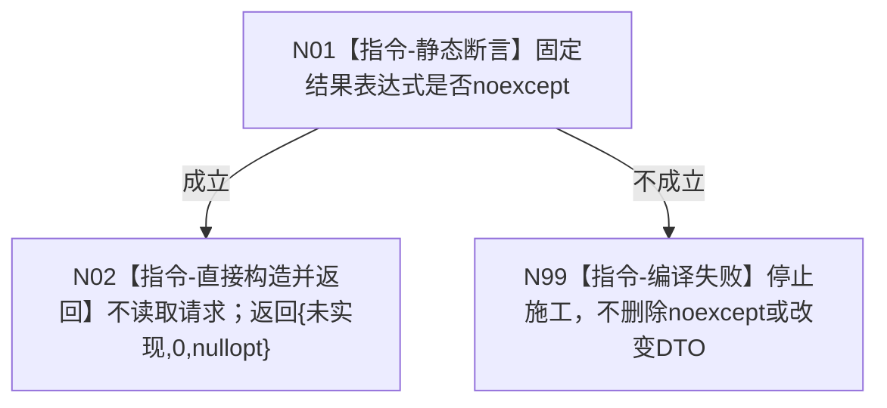

# 节点直接特征查询服务::读取具名已发布特征值材料 函数流程图 v0.1

日期：2026-08-03

设计身份：WORLD-TREE-P1BF v0.4 / F-P1BF-02

## 1. 依据与身份

```text
4201 §2—§5；WORLD-TREE-P1BF 特征双读取安全骨架业务流程图 v0.1；P1BF 详细设计 v0.3 §4
```

正式目标单函数施工图；只描述安全合同骨架，不证明具名材料真实可读。

## 2. 函数合同

```text
根函数：节点直接特征查询服务::读取具名已发布特征值材料
归属模块 / 文件 / 层级：海中鱼巣.领域.服务.节点直接特征查询 / 海中鱼巣/领域/服务.节点直接特征查询.ixx / L2
现有或待新增：待新增第二公开骨架；后继 FEATURE-HQ 原位替换函数体
完整签名：节点直接具名特征值材料读取结果 节点直接特征查询服务::读取具名已发布特征值材料(const 节点直接具名特征值材料读取请求& 请求) const noexcept
参数：请求包含合同版本和特征值完整身份见证；const借用；仅本次同步调用存续；骨架不解引用、不保存
返回结果：调用方按值拥有；固定未实现8、事实截止代次0、材料nullopt
被调函数流程图：无；骨架零下层调用
```

## 3. 流程图



## 4. 节点合同

| 节点 | 类型 | 参数/输入绑定 | 结果/输出绑定 | 事实读写 | 后继 | 验证 |
| --- | --- | --- | --- | --- | --- | --- |
| N01 | 本函数内静态断言 | 固定 prvalue 类型 | 编译期布尔 | 无 | 成立/N02；不成立/N99 | `static_assert(noexcept(...))` |
| N02 | 本函数内构造并返回 | 请求不解引用 | `{节点直接特征读取状态::未实现, 0, std::nullopt}` | 零读取、零写入 | 函数结束 | 任意输入逐字段相同；调用边0 |
| N99 | 编译期停止 | 无 | 无运行期结果 | 无 | 停止 | 不得用 catch-all 或默认构造绕过 |

## 5. 关键边界

```text
不得验证请求后返回入口拒绝；不得回显特征值；不得调用结构_；不得从SQL、材料、缓存或旧特征服务读取；不得把未实现改为未找到或空成功。真实 FEATURE-HQ 只能在原签名内替换函数体。
```

上游业务图：`流程图/20260803_WORLD-TREE-P1BF_特征双读取安全骨架业务流程图_v0.1.md`。

同服务既有函数图：`流程图/20260803_节点直接特征查询服务读取宿主组完整当前特征_函数流程图_v0.2.md`。
