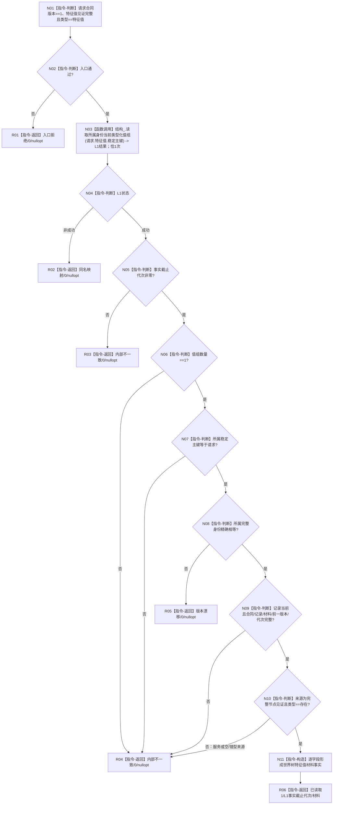

# 节点直接特征查询服务::读取具名已发布特征值材料 函数流程图 v0.2

日期：2026-08-03

设计身份：WORLD-TREE-FEATURE-HQ / F-FHQ-01

## 1. 函数合同

```text
根函数：节点直接特征查询服务::读取具名已发布特征值材料
归属模块 / 文件 / 层级：海中鱼巣.领域.服务.节点直接特征查询 / 海中鱼巣/领域/服务.节点直接特征查询.ixx / L2
现有或待扩展：P1BF v0.4第二公开骨架原位替换
完整签名：节点直接具名特征值材料读取结果 节点直接特征查询服务::读取具名已发布特征值材料(const 节点直接具名特征值材料读取请求& 请求) const noexcept
参数：请求；const借用；调用方拥有；仅同步调用期存续；不保存
返回：调用方按值拥有；成功含非零代次和一个完整材料，非成功为代次0/nullopt
直接复杂被调函数：节点直接结构查询服务::读取所属身份当前类型化值组(节点稳定主键)，恰1次
```

## 2. 流程图



## 3. 节点合同

| 节点 | 类型 | 输入绑定 | 输出绑定 | 事实读写 | 后继/验证 |
| --- | --- | --- | --- | --- | --- |
| N01—N02 | 本函数内判断 | 请求合同版本、特征值见证 | 准入布尔 | 只读参数 | 非法时N03调用0 |
| N03 | 函数调用 | `请求.特征值.稳定主键 -> 所属身份` | `节点直接类型化值读取结果 -> L1结果` | L1一次许可只读 | 每次外层调用至多且成功准入后恰1次 |
| N04—N05 | 本函数内判断 | L1头 | 映射或继续 | 只读结果 | 非成功同名映射；成功代次必须非零 |
| N06—N08 | 本函数内判断 | 值组、所属身份、请求见证 | 唯一性/版本结论 | 只读值式材料 | 多项/错键内部不一致；同键异完整身份版本漂移 |
| N09 | 本函数内判断 | 唯一读回全部字段 | 完整性布尔 | 只读值式材料 | 任一矛盾内部不一致 |
| N10 | 本函数内判断 | 来源联合 | 存在来源 | 只读值式材料 | 服务来源、错型或不完整节点内部不一致 |
| N11 | 本函数内构造 | 唯一读回十字段 | 材料事实 | 只形成调用方值 | 逐字段零推断 |
| R01—R06 | 本函数内返回 | 冻结状态和载荷 | 具名结果 | 零写入 | 只有R06携带材料和非零代次 |

## 4. 完整性指令

```text
合同身份完整、合同版本非零；值记录身份完整、值记录版本非零；当前=true。
值记录版本==1时前一版本必须nullopt；版本>1时前一版本必须存在且等于当前版本-1。
材料按正式variant逐类完整：区间下界<=上界；稳定身份组每项完整；独立材料引用的身份/格式/字节数/SHA256完整；其它正式标量/向量形态成立。
首次发布代次非零；当前状态发布代次>=首次发布代次且<=L1事实截止代次。
来源必须为variant中的节点见证，见证完整且节点类型为存在；服务稳定身份分支一律内部不一致。
```

## 5. 异常和禁止边

整个实现位于 `try` 内。`std::bad_alloc`、`std::length_error` 返回资源失败/0/nullopt；其它异常返回内部不一致/0/nullopt。catch不得再次分配。禁止 SQL、4170批次记录/引用、旧特征栈、仓库、事务、写服务、日志、缓存和时钟调用。

上游业务图：`流程图/20260803_WORLD-TREE-FEATURE-HQ_具名已发布特征值材料真实读取业务流程图_v0.1.md`。
