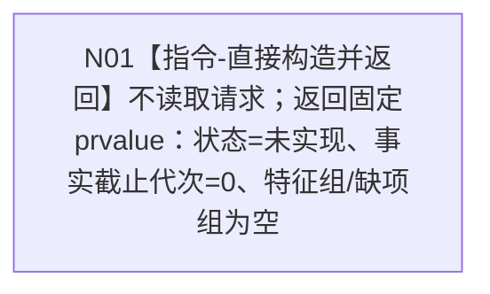

# 节点直接特征查询服务读取宿主组完整当前特征函数流程图 v0.1

更新时间：2026-08-03

## 依据

```text
4020、4030、4110、4170 v0.8、4200 v0.8、4201 v0.2
规范/详细设计/20260803_WORLD-TREE-P1BF_特征服务合同骨架详细设计_v0.1.md §4
```

## 身份与边界

正式目标单函数施工图；只描述 P1BF 安全合同骨架，不证明真实特征读取能力。

## 函数合同

```text
根函数：节点直接特征查询服务::读取宿主组完整当前特征
归属模块 / 文件 / 层级：海中鱼巣.领域.服务.节点直接特征查询 / 海中鱼巣/领域/服务.节点直接特征查询.ixx / L2
现有或待新增：待新增骨架；后继 FEATURE-Q 原位替换函数体
完整签名：节点直接特征组读取结果 节点直接特征查询服务::读取宿主组完整当前特征(const 节点直接宿主组特征读取请求& 请求) const noexcept
参数：请求包含查询合同版本、世界树请求头和宿主组；为const借用，仅本次同步调用存续；骨架不解引用、不保存
返回结果：调用方拥有值；固定未实现、事实截止代次0、特征组空、缺项组空
被调函数流程图：无；骨架零下层调用
```

## 流程图



## 节点合同

| 节点 | 类型 | 参数 / 输入绑定 | 结果 / 输出绑定 | 事实读写 | 后继条件 | 验证 |
| --- | --- | --- | --- | --- | --- | --- |
| N01 | 本函数内构造并返回 | 请求不解引用、无字段绑定 | 固定未实现空结果 -> 调用方 | 零读取、零写入 | 函数结束 | 任意输入同结果；依赖零调用；前后权威导出相等 |

## 关键边界

```text
固定prvalue表达式必须通过noexcept静态断言；不得删除函数noexcept或用catch-all再次构造同一结果。不得校验后返回入口拒绝；不得调用结构_；不得把未实现改成成功空组或未找到。
```
