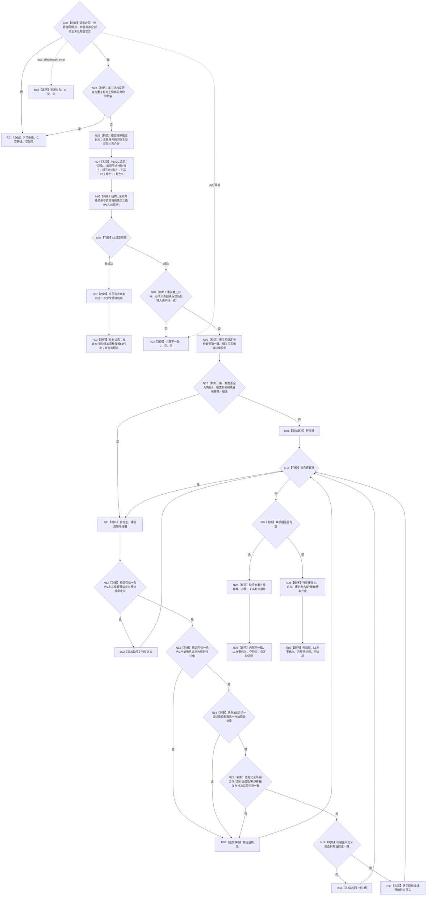

# 节点直接特征查询服务读取宿主组完整当前特征 函数流程图 v0.3

日期：2026-08-03

所属设计：WORLD-TREE-FEATURE-Q

状态：目标真实实现；等待 P1BF v0.4 骨架代码进入正式 main

## 函数合同

```text
模块：海中鱼巣.领域.服务.节点直接特征查询
文件：海中鱼巣/领域/服务.节点直接特征查询.ixx
完整签名：
节点直接特征组读取结果 读取宿主组完整当前特征(
    const 节点直接宿主组特征读取请求& 请求) const noexcept;

输入：P1BF v0.4 最终请求 DTO，包含合同版本、世界请求头和宿主组
输出：P1BF v0.4 最终结果 DTO；成功为非零事实截止、完整稳定排序特征组和空缺项组
唯一生产调用：结构_.读取两级关系与目标当前类型化值(P1A2G请求)
写事实：0
```

## 函数流程



## 节点与字段来源

| 节点 | 输入 | 输出 | 唯一来源 |
| --- | --- | --- | --- |
| N03—N05 | 请求 | P1A2G请求/结果 | 请求纯值 + 唯一结构服务调用 |
| N09—N10 | 第一跳关系 | 宿主关系、实例槽 | 关系22角色1 |
| N12 | 相关关系 | 定义关系、特征定义 | 关系22角色2 |
| N13—N14 | 相关关系、目标值投影 | 当前值关系、当前值及原始记录 | 关系22角色3 + P1A2G目标值组 |
| N15 | 类型化值读回 | 合同/记录/材料/来源/发布代次 | 同一 `类型化值读回` |
| N17 | 上述完整材料 | `世界树特征事实` | 逐字段复制，不补造 |

## 固定状态映射

| L1状态 | FEATURE-Q状态 | 事实截止 | 特征组 | 缺项组 |
| --- | --- | --- | --- | --- |
| 成功 | 已读取 | 非零 | 完整 | 空 |
| 未找到 | 未找到 | 原样，可为0或非零 | 空 | 空 |
| 入口拒绝 | 入口拒绝 | 0 | 空 | 空 |
| 版本漂移 | 版本漂移 | L1非零代次 | 空 | 空 |
| 许可拒绝 | 许可拒绝 | 0 | 空 | 空 |
| 资源失败 | 资源失败 | 0 | 空 | 空 |
| 内部不一致 | 内部不一致 | 0 | 空 | 空 |
| 成功材料但业务不完整 | 内部不一致 | L1非零代次 | 空 | 稳定缺项 |

## 关键机械约束

```text
生产成员调用恰一：结构_.读取两级关系与目标当前类型化值。
不得连续调用其它L1读取、取得许可、重试、sleep或比较多次代次。
关系和值的去重身份分别只用稳定主键和值记录稳定身份；版本参与排序与冲突，不进入身份键。
任何非成功不得携带部分世界树特征事实。
异常分支不得分配诊断载荷；业务缺项分支与异常内部不一致分开。
```
