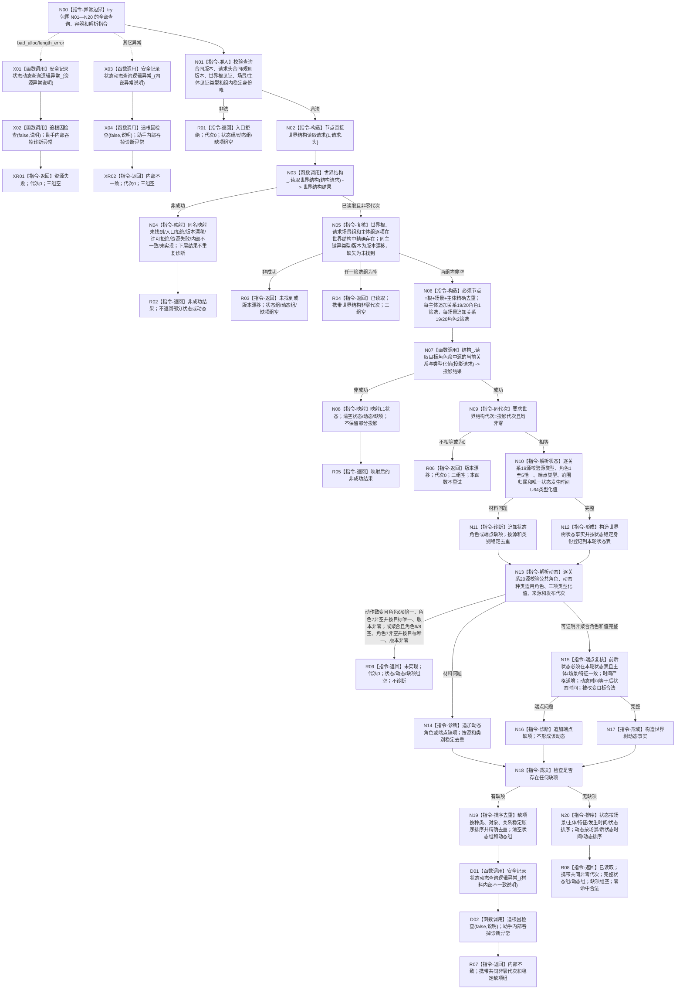

# 节点直接状态动态查询服务读取世界状态动态函数流程图 v0.2

更新时间：2026-08-03

设计身份：WORLD-TREE-P1B-Q v0.1

## 1. 身份与边界

```text
唯一根函数：节点直接世界状态动态读取结果 节点直接状态动态查询服务::读取世界状态动态(const 节点直接世界状态动态读取请求& 请求) const noexcept
物理位置：海中鱼巣/领域/服务.节点直接状态动态查询.ixx
层级：L2 状态动态只读服务
施工形态：原位替换 P1B-F 的固定未实现函数体；公开 DTO、类构造、成员和签名不变
输入所有权：调用方拥有，请求仅在调用期 const 借用，函数不保存
输出所有权：调用方拥有完整值，不含许可、锁、仓库、句柄、引用或 SQL 对象
机器事实：只读内存权威事实；零写入、零比较、零发布、零 SQL；本层首次资源/内部异常仅写诊断旁路
```

被调业务提供者函数仅有：

```text
世界结构读取结果 节点直接世界结构读取服务::读取世界结构(const 节点直接世界结构读取请求& 请求) const noexcept
节点直接目标角色源投影结果 节点直接结构查询服务::读取目标角色命中源的当前关系与类型化值(const 节点直接目标角色源投影请求& 请求) const noexcept
```

诊断边仅有：

```text
void 安全记录状态动态查询逻辑异常_(const wchar_t* 说明) noexcept
bool 追根因检查(bool 条件, const wchar_t* 消息)  // 物理提供者：海中鱼巣/核心/容错检查.h
```

## 2. 单根函数流程图



## 3. 节点实现合同

| 节点组 | 输入 | 输出 | 分支和不变量 | 验证 |
| --- | --- | --- | --- | --- |
| N01—N05 | 请求、世界结构结果 | 已验证范围 | 请求组可空；非空项类型固定；只接受根、场景、主体的当前精确见证 | 非法、缺失、同主键异版本/类型矩阵 |
| N06—N09 | 已验证范围 | 单一共同事实截止的 P1B-M 材料 | 两组均非空才调用 P1B-M；两个提供者各恰调用一次；不重试 | AST 调用边和代次漂移测试 |
| N10—N12 | 关系19源投影 | 状态表或状态缺项 | 五角色恰一；未知/额外角色拒绝；发生时间值恰一且证据完整 | 角色、类型、值材料、来源、代次矩阵 |
| N13—N17 | 关系20源投影和状态表 | 非聚合动态事实、未实现或动态/端点缺项 | 公共角色恰一；四类非聚合形状精确；聚合动作要求角色6/8恰一、聚合动态要求角色6/8为空，两者角色7非空并按目标唯一且版本非零后才整轮未实现；前后状态来自本轮状态表 | 非聚合四类、两类聚合基础形状、聚合未实现、端点、时间和来源矩阵 |
| D01—D02、X01—X04 | 本层首次材料内部不一致、资源异常或其它异常 | 诊断旁路完成 | 公开根只调用私有无抛助手；助手唯一调用 `容错检查.h::追根因检查` 并吞掉诊断异常 | AST 两级调用边、诊断异常不改变机器返回 |
| N18—N20 | 临时完整事实及诊断 | 唯一结果 | 有缺项不返回部分事实；无缺项允许状态/动态同时为空 | 稳定排序、去重和全空合法成功 |

## 4. 异常边

整个函数体位于 `try` 内。`std::bad_alloc` 或 `std::length_error` 经模块私有无抛助手诊断一次后返回 `资源失败`、代次0、三组空；其它异常同样诊断一次后返回 `内部不一致`、代次0、三组空。本根发现并最终返回的材料内部不一致只诊断一次；下层非成功和合法未实现不重复诊断。异常不得越过 `noexcept`，不得重试、休眠、读时钟或改由 SQL 回源。

## 5. 完成边界

本图只冻结 P1B-Q 根函数的真实非聚合只读查询和聚合安全未实现过程。它不证明 P1B-F、P1B-M 或 P1A3 已实现，不证明聚合 DAG、状态/动态写入、比较、发布、完整世界快照、生产接线或服务验收完成。
