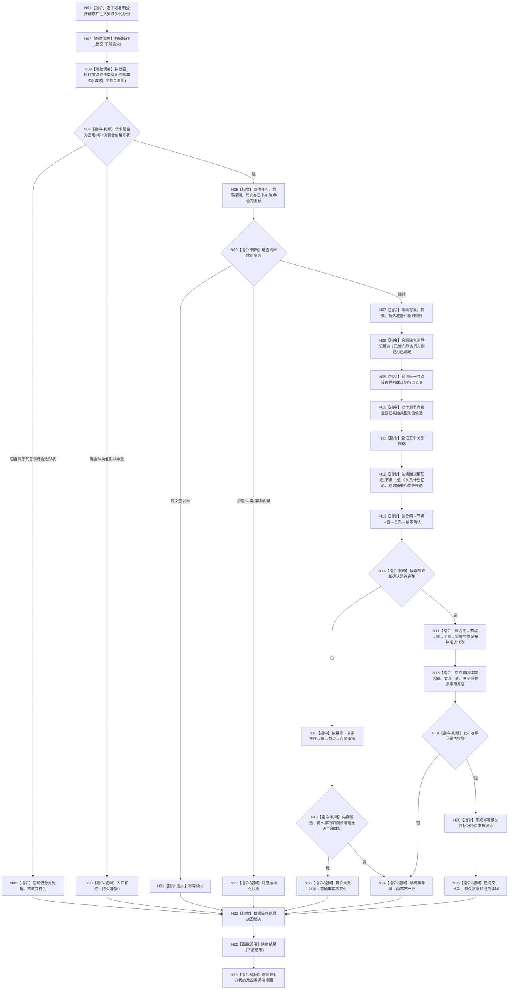

# 节点直接类型化结构提交服务提交混合原子写集函数流程图 v0.1

日期：2026-08-03

代码基线：`466d1ab0272ebb122203354a2a1e7be893db964a`

## 根函数合同

```cpp
节点直接类型化结构提交结果
节点直接类型化结构提交服务::提交(
    const 节点直接类型化结构事务请求& 请求) const;
```

- 模块/文件：`海中鱼巣.核心.服务.节点直接类型化结构提交` / `海中鱼巣/核心/服务.节点直接类型化结构提交.ixx`。
- 参数：调用方拥有、同步只读借用；函数不保存引用。
- 返回：调用方按值拥有；八个现行状态值不变。
- 成员：安装实例身份按值，数据操作非空引用由装配拥有并长于服务。
- 本计划不修改根签名或服务函数体；它补齐根已委托的执行器成功分支，使该公开根真实消费目标混合请求。

## 流程图



## 节点合同

| 节点组 | 输入 | 输出 | 事实读写 | 后继 | 验证 |
| --- | --- | --- | --- | --- | --- |
| N01—N03 | 公开请求 | 下层数据操作结果 | 仅复制值；N03进入事务域 | N04 | AST调用各1次 |
| N04 | 写项/读回变体和顺序 | 目标形状/其它/非法 | 无机器写入 | N05/N80/N90 | 8/7边界、非法混合准备0 |
| N05—N06 | 幂等、代次、端点、合同 | 继续或八状态之一 | 只读内存权威 | N07或返回 | 同义、异义、漂移矩阵 |
| N07 | 请求、计划身份 | 写集材料、摘要、尝试序号 | 持久旁路准备；无普通事实 | N08 | CNG故障、端口八状态 |
| N08—N12 | 固定8写7读 | 四仓候选和幂等候选 | 仅本事务候选可见 | N13 | 候选逐点故障注入 |
| N13—N16 | 候选组 | 全确认或完整撤销 | 确认不普通可见；撤销逆序 | N17或N93/N94 | 每一确认/撤销故障 |
| N17—N20 | 已确认候选 | 已发布通用读回 | 唯一普通发布边界 | N95/N94 | 代次+1、原许可读回 |
| N21—N22 | 下层八状态/结果 | 公开同义结果 | 无新增写入 | N99 | 八状态逐项相等 |

## 固定形状判据

```text
写0 类型合同发布项
写1 节点创建项
写2 初始类型化值发布项
写3..7 关系创建项
读0 当前节点(写1局部身份,版本1)
读1 当前类型化值(写2局部身份,版本1)
读2..6 当前关系(写3..7局部身份,版本1)
空参与者组
```

值所属身份等于写1局部身份、无前值版本、合同等于写0、来源为当前节点见证；五关系源端等于写1局部身份且目标端为当前节点见证。L1不检查关系业务类型或角色组合是否属于状态。

## 关键边界

- 服务根、数据操作入口和八状态 ABI 不变。
- SQL持久端口不参与成功/失败机器语义，只承载准备和发布见证。
- 发布前任一失败必须完整逆序撤销；撤销失败或发布阶段矛盾必须隔离。
- 不支持的其它混合形状仍入口拒绝，不顺带扩成通用任意混合写执行器。
