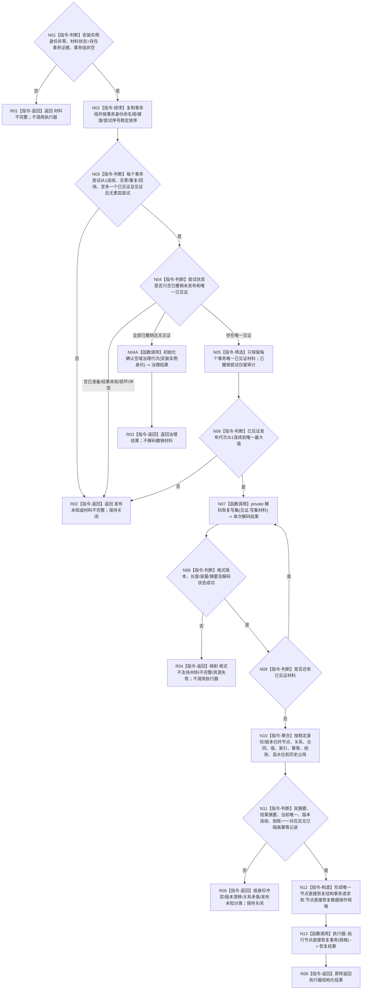

# 节点直接类型化结构数据操作恢复目标函数流程图 v0.2

更新时间：2026-08-03

## 依据

```text
正式规范：4040、4070、4200
修订设计：20260803_WORLD-TREE-P1A2_显式节点命名域与恢复私有解码详细设计_v0.2
当前事实：数据操作已有 private 解码恢复写集骨架；现有恢复入口错误地要求调用方提供完整强类型请求
```

## 身份与边界

本图只描述数据操作的原始恢复材料入口。它唯一拥有逐尝试审计、私有解码和强类型恢复请求聚合；执行器继续唯一拥有六仓事务发布。

## 函数合同

```text
根函数：节点直接类型化结构数据操作::恢复
归属模块 / 文件 / 层级：海中鱼巣.核心.数据操作.节点直接类型化结构 / 海中鱼巣/核心/数据操作.节点直接类型化结构.ixx / L1 数据操作
现有或待新增：替换现有不可达签名
完整签名：节点直接恢复数据操作结果 恢复(节点直接事务幂等身份 安装实例身份, const 节点直接恢复材料读取结果& 材料) const
参数：安装实例身份按值；材料为只读借用，恢复服务拥有至同步返回；函数不保存引用
返回结果：节点直接恢复数据操作结果；成功交由执行器返回，材料/格式/身份/版本/关系/资源/发布未知按现有枚举分类
被调函数流程图：20260803_执行节点直接恢复事务_函数流程图_v0.1.md
```

## 流程图



## 节点合同

| 节点 | 类型 | 参数 / 输入绑定 | 结果 / 输出绑定 | 事实读写与后继 | 验证 |
| --- | --- | --- | --- | --- | --- |
| N01 | 指令-判断 | 安装实例身份、材料 | 准入真假 | 只读 | 非法到 R01 | 数据操作重复准入 |
| N02—N06 / N04A | 指令 / 函数调用 | 事务组、安装实例身份 | 稳定尝试序列、唯一见证组或治理结果 | 只读复制；全撤销分支可发布治理代次 | 失败到 R02；全撤销到 R03 | 连续、唯一、无未知；撤销材料不解码 |
| N07 | 函数调用 | 单次原始字节 | 私有解码结果 | 临时材料 | 到 N08 | 只有此调用点 |
| N08—N09 | 指令 | 解码结果/迭代位置 | 继续或失败 | 临时容器 | 失败到 R04 | 上限和异常分类 |
| N10—N12 | 指令 | 全部强类型单次请求 | 聚合恢复请求/规格 | 仅本函数局部值 | 失败到 R05，成功到 N13 | 六领域互证 |
| N13 | 函数调用 | 完整规格 | 恢复数据操作结果 | 执行器内部恢复事务 | 到 R06 | 只调用一次 |
| R01—R06 | 指令-返回 | 分支材料 | 结构化结果 | 不补写 | 终止 | 不伪装成功 |

## 关键边界

```text
解码器保持 private，不 export、不 friend、不复制。
数据操作旧 恢复(const 节点直接恢复结构事务请求&) 直接删除；不双路接受。
数据操作不取得 SQL 连接；只消费端口已经返回的值式材料。
执行器不读取原始字节；只接受数据操作聚合后的强类型规格。
```

## 验证

1. 数据操作模块唯一命中一个 private `解码恢复写集` 声明及其内部调用。
2. 服务文件对解码器和强类型请求聚合零命中。
3. 旧恢复签名零命中，新的原始材料签名恰一处声明、一处调用。
