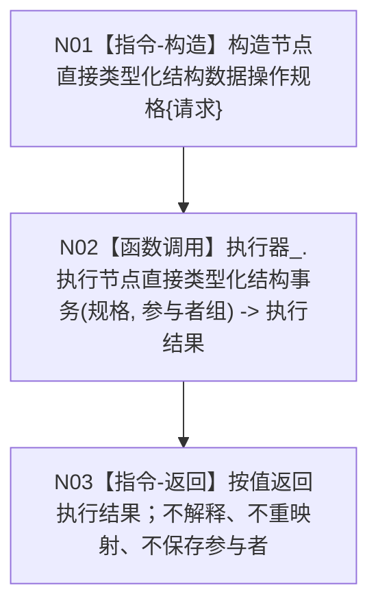

# 节点直接类型化结构数据操作提交带参与者事务函数流程图 v0.1

更新时间：2026-08-03

## 依据

```text
目标业务图：流程图/20260803_WORLD-TREE-FEATURE-W-MC_类型化结构事务参与者桥接业务流程图_v0.1.md
详细设计：规范/详细设计/20260803_WORLD-TREE-FEATURE-W-MC_类型化结构事务参与者桥接详细设计_v0.1.md
当前实现基线：4232074bafbcc0bb01ccad7b739851e9af547a36
```

## 身份与边界

正式目标单函数施工图。该函数是核心数据操作层面唯一带参与者入口，只作业务中性逐字段转发；它不解释参与者类型、不保存地址、不组装领域参与者，也不改变 L2 公开服务合同。

## 函数合同

```cpp
节点直接类型化结构数据操作结果
节点直接类型化结构数据操作::提交带参与者事务(
    const 节点直接类型化结构数据操作请求& 请求,
    std::span<节点直接类型化结构事务参与者* const> 参与者组) const;
```

| 参数 | 方向 / 所有权 | 生命周期 | 非法值 |
| --- | --- | --- | --- |
| `请求` | 只读借用；调用方拥有 | 同步调用期间 | 由执行器按现行请求合同裁决 |
| `参与者组` | 只读借用地址组；调用方拥有对象 | 必须覆盖整个同步调用 | 空指针、重复地址；空组合法 |

返回：逐值返回执行器的 `节点直接类型化结构数据操作结果`；不改写状态、发布代次、持久状态或四组读回。

## 流程图



## 节点合同

| 节点 | 类型 | 参数 / 输入绑定 | 结果 / 输出绑定 | 事实读写 | 后继条件 | 验证 |
| --- | --- | --- | --- | --- | --- | --- |
| N01 | 本函数内指令 | 请求 -> 规格.请求 | 完整规格 | 无 | 构造完成 | 字段逐项相等 |
| N02 | 函数调用 | 规格、参与者组原样传递 | 执行结果 | 由执行器拥有事务行为 | 调用返回 | 调用次数恰一 |
| N03 | 本函数内返回 | 执行结果 | 数据操作结果 | 无新增写入 | 无 | 八状态及所有字段逐值相等 |

## 旧入口委托合同

现有：

```cpp
节点直接类型化结构数据操作结果 提交(
    const 节点直接类型化结构数据操作请求& 请求) const;
```

目标函数体固定为：构造空 `span<节点直接类型化结构事务参与者* const>`，调用 `提交带参与者事务(请求, 空组)` 并原样返回。旧调用方、公开服务与 ABI 不接触参与者类型。

## 双向引用

- 被调根函数图：[节点直接身份结构写入执行器执行带参与者类型化结构事务](20260803_节点直接身份结构写入执行器执行带参与者类型化结构事务_函数流程图_v0.1.md)
- 业务图：[WORLD-TREE-FEATURE-W-MC 类型化结构事务参与者桥接](20260803_WORLD-TREE-FEATURE-W-MC_类型化结构事务参与者桥接业务流程图_v0.1.md)
