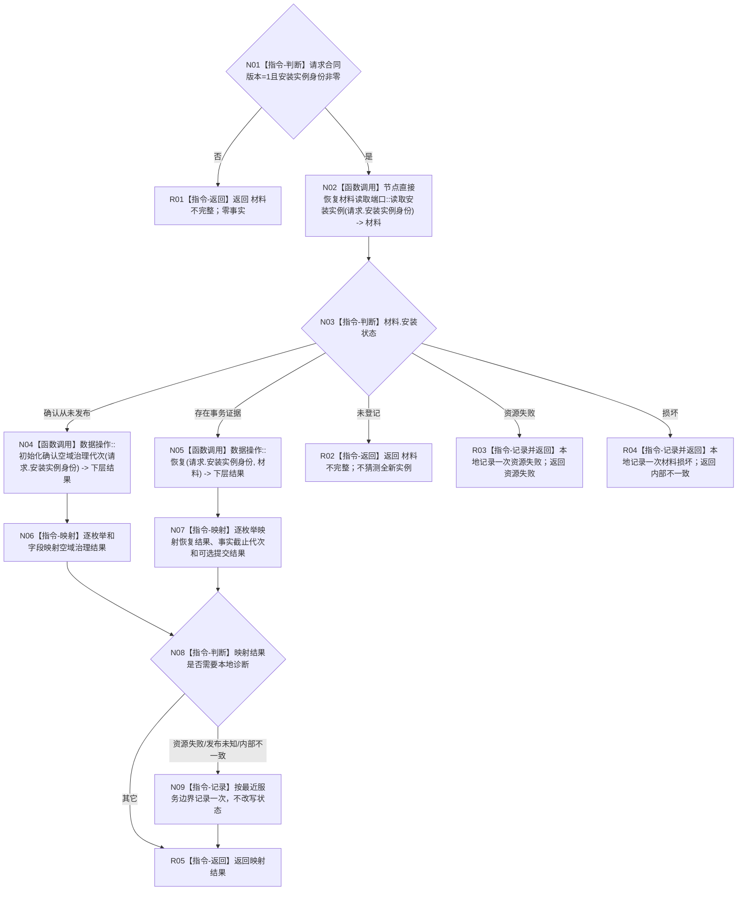

# 节点直接结构恢复服务恢复安装实例目标函数流程图 v0.2

更新时间：2026-08-03

## 依据

```text
正式规范：4040、4070、4200
修订设计：20260803_WORLD-TREE-P1A2_显式节点命名域与恢复私有解码详细设计_v0.2
当前事实：持久恢复材料端口已导出值式读取结果；恢复服务目标文件尚不存在
```

## 身份与边界

本图只描述恢复服务边界函数。它读取端口并分流，不解码写集、不审计逐尝试内容、不构造六仓强类型恢复请求。

## 函数合同

```text
根函数：节点直接结构恢复服务::恢复安装实例
归属模块 / 文件 / 层级：海中鱼巣.核心.服务.节点直接结构恢复 / 海中鱼巣/核心/服务.节点直接结构恢复.ixx / L1 服务边界
现有或待新增：待新增
完整签名：节点直接结构恢复结果 恢复安装实例(const 节点直接安装实例恢复请求& 请求) const
参数：请求，只读借用；调用方拥有至同步返回；合同版本和安装实例身份必须有效
返回结果：调用方拥有的纯值恢复结果；映射已恢复/治理空域/材料/资源/发布未知/内部不一致
被调函数流程图：20260803_节点直接类型化结构数据操作恢复_函数流程图_v0.2.md
```

## 流程图



## 节点合同

| 节点 | 类型 | 参数 / 输入绑定 | 结果 / 输出绑定 | 事实读写 | 后继条件 | 验证 |
| --- | --- | --- | --- | --- | --- | --- |
| N01 | 指令-判断 | 请求 | 有效真假 | 只读 | 非法到 R01 | 非零身份、合同版本 |
| N02 | 函数调用 | 安装实例身份 | 值式材料 | 只读持久证据 | 到 N03 | 只调用一次 |
| N03 | 指令-判断 | 安装状态 | 五分支 | 无 | 分别到 N04/N05/R02/R03/R04 | 五状态覆盖 |
| N04 | 函数调用 | 安装实例身份 | 空域治理结果 | 可能发布治理代次 | 到 N06 | 只在确认从未发布时调用 |
| N05 | 函数调用 | 安装实例身份、原始材料 | 数据操作恢复结果 | 数据操作/执行器内处理 | 到 N07 | 不先解码或聚合 |
| N06—N09 | 指令 | 下层结果 | 服务结果 | 仅诊断 | 到 R05 | 显式枚举映射 |
| R01—R05 | 指令-返回 | 分支材料 | 结构化结果 | 无新增写入 | 终止 | 不伪装成功 |

## 关键边界

```text
服务模块内不得出现 解码恢复写集、节点直接恢复结构事务请求 聚合、六仓候选或执行器写调用。
未登记不等于确认从未发布；只有端口明确状态才能进入治理代次入口。
旧“恢复服务解码并形成强类型请求”路径直接删除，不保留兼容入口。
```

## 验证

1. 本图一图一根函数，服务只调用端口和数据操作。
2. 静态扫描服务文件对 `解码恢复写集|节点直接恢复结构事务请求|执行节点直接恢复事务` 零命中。
3. 五个端口状态和十二个数据操作结果状态均有确定映射。
