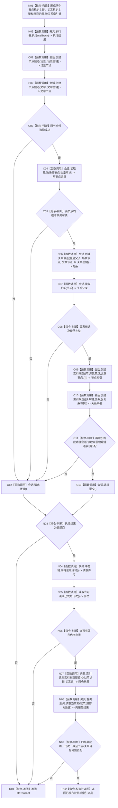

# 节点直接结构查询专项自检形成已发布双目标索引夹具函数流程图 v0.1

更新时间：2026-08-03

## 依据

```text
WORLD-TREE-P1A2Q 按精确索引键读取当前目标详细设计 v0.2 §5
WORLD-TREE-P1A2Q 故障注入补充详细设计 v0.2
WORLD-TREE-P1A2Q 关系索引夹具补充详细设计 v0.3
当前核心接口：节点直接身份结构写入执行器、节点直接身份结构写入会话、可重建索引记录
```

## 身份与边界

本图是 P1A2Q 专项自检模块私有目标单函数施工图。它只在隔离仓对象上形成节点目标和关系目标索引基线，不新增生产提交能力，不改变公开 DTO。

## 函数合同

```text
根函数：形成已发布双目标索引夹具
归属模块 / 文件 / 层级：海中鱼巣.核心.自检.节点直接结构查询 / 核心/自检.节点直接结构查询.ixx / 专项自检
现有或待新增：待新增的模块私有辅助函数
完整签名：std::optional<精确索引查询已发布夹具> 形成已发布双目标索引夹具(精确索引查询隔离夹具& 夹具)
参数：夹具 -> 非空可变借用；拥有隔离六仓、事务域、执行器和查询服务，生命周期覆盖同步调用；函数不保存引用
返回结果：成功返回调用方拥有的两索引键、节点句柄、关系句柄和非零已发布代次；任一形成/发布/基线读回失败返回 std::nullopt
被调函数流程图：生产读取根见两张 P1A2Q v0.3 函数流程图；执行器/会话沿当前 CORE-C1/v1 既有代码事实，不在本计划重制
```

## 流程图



## 节点合同

| 节点 | 类型 | 参数 / 输入绑定 | 结果 / 输出绑定 | 事实读写 | 后继条件 | 验证 |
| --- | --- | --- | --- | --- | --- | --- |
| N01 | 本函数内构造 | 隔离夹具身份基数 | 三稳定主键、两完整互异索引键 | 只构造局部值 | 到 N02 | 键/主键完整且互异 |
| N02 / C01—C13 | 函数调用 / 判断 | 局部身份和 `夹具.执行器` | 执行状态、节点/关系句柄 | 在同一隔离事务建立两节点、一关系、两索引候选；统一确认/撤销/发布 | 完整请求提交；其它请求撤销 | 单次执行器调用；零直接仓确认/发布 |
| N03 / R01 | 本函数内判断 / 返回 | 执行结果 | 失败空值 | 无新写入 | 非已提交结束 | 失败不得补写/重建 |
| N04—N06 | 函数调用 / 判断 | 夹具事务域 | 共享许可和非零代次 | 只读已发布代次 | 无效到 R01 | 写事务已经结束 |
| N07 | 函数调用 | 两索引键 | 节点/关系内部记录 | 只读索引及权威目标 | 到 N08 | 两目标种类互异且句柄匹配 |
| N08—N09 | 函数调用 / 判断 | 两索引键 | 两个稳定公开读回 | 只读同代次事实 | 不完整到 R01；完整到 R02 | 节点/关系分支都真实到达 |
| R02 | 本函数内构造 / 返回 | 两键、两句柄、代次 | 值式已发布夹具 | 无 | 函数结束 | 后继故障矩阵唯一夹具来源 |

## 关键边界

```text
公开 P1A2 提交服务只支持节点目标索引，不是关系夹具形成路径。
专项自检只能经现有执行器和会话形成关系索引；不得直接调用仓库确认、发布、恢复或写私有容器。
基线形成会写隔离对象；后续被测读取和防御谓词注入本身必须零机器事实写入。
执行器回调、许可和会话不越过同步调用；返回值不携带许可、会话或容器引用。
```
