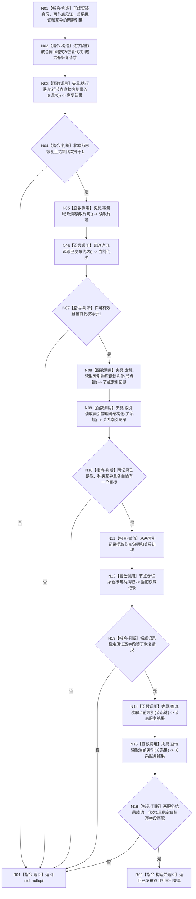

# 节点直接结构查询专项自检形成已发布双目标索引夹具函数流程图 v0.2

更新时间：2026-08-03

## 依据

```text
WORLD-TREE-P1A2Q 按精确索引键读取当前目标详细设计 v0.2
WORLD-TREE-P1A2Q 故障注入补充详细设计 v0.2
WORLD-TREE-P1A2Q 恢复式双目标索引夹具补充详细设计 v0.4
当前核心接口：执行节点直接恢复事务、节点直接恢复结构事务请求、两类索引恢复读回
```

## 身份与边界

本图是 P1A2Q 专项自检模块私有目标单函数施工图。它以现有恢复执行器一次形成
两节点、一关系、节点目标索引、关系目标索引和非零恢复代次；不新增生产提交能力。

## 函数合同

```text
根函数：形成已发布双目标索引夹具
归属模块 / 文件 / 层级：海中鱼巣.核心.自检.节点直接结构查询 / 核心/自检.节点直接结构查询.ixx / 专项自检
现有或待新增：待新增的模块私有辅助函数
完整签名：std::optional<精确索引查询已发布夹具> 形成已发布双目标索引夹具(精确索引查询隔离夹具& 夹具)
参数：夹具 -> 非空可变借用；拥有等待恢复事务域、六仓、完整八参数执行器和查询服务；不保存引用
返回结果：成功返回两索引键、从正式索引读回取得的节点/关系句柄和代次1；任一恢复或读回失败返回 std::nullopt
被调函数流程图：生产读取根见两张 P1A2Q v0.3 图；恢复执行器沿当前 P1A2 正式代码事实，不在本计划重制
```

## 流程图



## 节点合同

| 节点 | 类型 | 参数 / 输入绑定 | 结果 / 输出绑定 | 事实读写 | 后继条件 | 验证 |
| --- | --- | --- | --- | --- | --- | --- |
| N01—N02 | 本函数内构造 | 专项固定身份 | 完整恢复请求 | 只构造局部值 | 到 N03 | 两类索引分别绑定稳定节点/关系见证 |
| N03 | 函数调用 | 请求 -> `节点直接恢复数据操作规格` | 恢复状态、代次 | 同一恢复事务发布六仓并最后开放代次 | 调用完成 | 恢复入口恰一次；callback 入口零调用 |
| N04 / R01 | 判断 / 返回 | 恢复结果 | 空值 | 无补写 | 非成功结束 | 代次0不可成功 |
| N05—N07 | 函数调用 / 判断 | 事务域 | 读取许可、当前代次 | 只读 | 代次1到 N08 | 与恢复结果一致 |
| N08—N11 | 函数调用 / 判断 / 赋值 | 两索引键 | 两内部记录、两句柄 | 只读索引 | 完整到 N12 | 句柄只来自正式读回 |
| N12—N13 | 函数调用 / 判断 | 两句柄、请求见证 | 权威记录 | 只读节点/关系 | 匹配到 N14 | 稳定见证逐字段相等 |
| N14—N16 | 函数调用 / 判断 | 两键、请求见证、代次1 | 两公开服务结果 | 只读同代次事实 | 完整到 R02 | 节点/关系分支都真实到达 |
| R02 | 构造并返回 | 两键、两句柄、代次1 | 值式夹具 | 无 | 结束 | 后继故障矩阵唯一基线 |

## 关键边界

```text
事务域必须以等待恢复模式构造；执行器必须使用六仓和私有持久端口的完整八参数构造。
本函数只调用执行节点直接恢复事务，不调用低层 callback 入口。
不得直接调用仓库恢复候选、确认或发布，不得按恢复排序猜测内部句柄。
恢复形成隔离基线；后继防御谓词测试本身仍须零机器事实变化。
```
