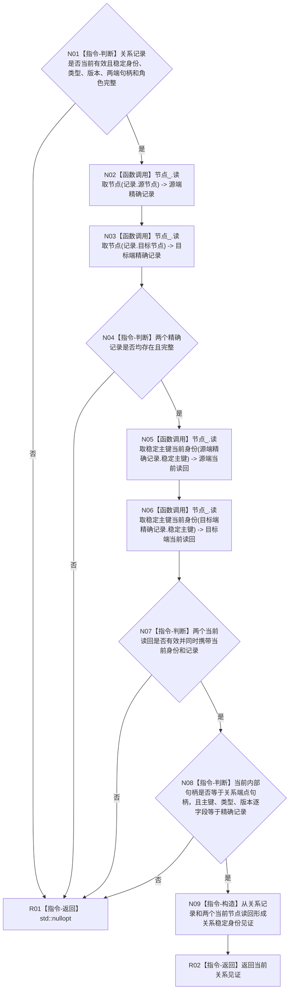

# 节点直接结构查询服务形成当前关系见证函数流程图 v0.1

更新时间：2026-08-03

## 依据

```text
规范/4010_子规范_统一仓库稳定句柄与通用关系索引边界.md §4/§6.1 候选修订
规范/详细设计/20260803_WORLD-TREE-P1A2G_两级关系与目标当前类型化值同许可投影详细设计_v0.1.md §6.1
```

## 身份与边界

本图只描述 P1A2G 根函数持有共享许可期间对一条关系记录的当前端点复核。空结果由唯一调用方映射为内部不一致。

## 函数合同

```text
根函数：节点直接结构查询服务::形成当前关系见证_
归属模块 / 文件 / 层级：海中鱼巣.核心.服务.节点直接结构 / 海中鱼巣/核心/服务.节点直接结构.ixx / L1 private
现有或待新增：待新增私有助手
完整签名：std::optional<关系稳定身份见证> 形成当前关系见证_(const 正式关系记录& 记录) const
参数：记录为调用期间 const 借用；必须是当前有效、稳定身份/类型/版本/端点/角色完整的仓库值副本
返回结果：端点仍是当前同一内部对象时返回调用方拥有的关系稳定身份见证；正常缺失或矛盾返回 std::nullopt；节点仓锁异常上浮到公开根函数统一映射
被调函数流程图：无；两个节点仓读取均为现有简单仓库函数
```

## 流程图



## 节点合同

| 节点 | 类型 | 参数 / 输入绑定 | 结果 / 输出绑定 | 事实读写 | 后继条件 | 验证 |
| --- | --- | --- | --- | --- | --- | --- |
| N01 | 指令-判断 | 关系记录 | 完整/拒绝 | 无 | 完整 | 坏记录零节点读取 |
| N02—N04 | 函数调用/判断 | 两端内部句柄 | 两个精确记录 | 只读节点仓 | 两端存在 | 悬空端点返回空 |
| N05—N08 | 函数调用/判断 | 两端稳定主键 | 当前身份与记录 | 只读节点仓 | 当前对象逐字段同一 | 换代/删除返回空 |
| N09/R02 | 指令 | 已复核记录 | 关系见证 | 无 | 完成 | 字段只来自读回 |
| R01 | 指令-返回 | 任一矛盾 | 空 optional | 无 | 结束 | 调用方映射内部不一致 |

## 关键边界

```text
助手不取得许可、不读取关系仓或类型化值仓、不排序、不记录日志。
只有已持有事务域共享许可的根函数可以调用；返回空不是“关系未找到”的业务结果。
```
