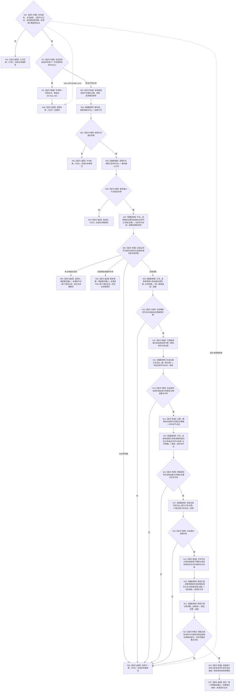

# 节点直接结构查询服务读取两级关系与目标当前类型化值函数流程图 v0.1

更新时间：2026-08-03

## 依据

```text
规范/4010_子规范_统一仓库稳定句柄与通用关系索引边界.md §6.1 候选修订
规范/4020_子规范_领域类型化数据记录与组合读取投影边界.md §3/§5/§6
规范/详细设计/20260803_WORLD-TREE-P1A2G_两级关系与目标当前类型化值同许可投影详细设计_v0.1.md §3—§8
```

## 身份与边界

本图是 P1A2G 目标单函数施工图，只形成一次 L1 共享许可内的业务中性两级关系与类型化值投影；不解释关系22或其它领域角色，不写事实，不查询 SQL。

## 函数合同

```text
根函数：节点直接结构查询服务::读取两级关系与目标当前类型化值
归属模块 / 文件 / 层级：海中鱼巣.核心.服务.节点直接结构 / 海中鱼巣/核心/服务.节点直接结构.ixx / L1
现有或待新增：待新增到既有 final 类
完整签名：节点直接两级关系值投影结果 读取两级关系与目标当前类型化值(const 节点直接两级关系值投影请求& 请求) const noexcept
参数：请求为调用期间 const 借用；合同版本、关系类型、节点见证、组内稳定身份唯一性或根子集非法时入口拒绝
返回结果：调用方拥有的纯值结果；成功携带唯一非零事实截止代次、必须节点、两级关系和逐目标关系当前值组；未找到/版本漂移可具名首个未满足请求见证；其它非成功代次0且业务载荷全空
被调函数流程图：`20260803_节点直接结构查询服务形成当前关系见证_函数流程图_v0.1.md`；仓库与事务域函数沿现有代码事实，不在本设计包重复画图
```

## 流程图



## 节点合同

| 节点 | 类型 | 参数 / 输入绑定 | 结果 / 输出绑定 | 事实读写 | 后继条件 | 验证 |
| --- | --- | --- | --- | --- | --- | --- |
| N01/T01/T02/N02 | 指令 | `请求`、测试宏私有一次性标志 | 稳定排序副本或资源失败 | 无 | 准入成立 | 坏请求不消费注入；合法注入先清零 |
| N03—N06 | 函数调用/判断 | 事务域 | 一次读取许可、唯一事实截止 | 只读代次 | 许可有效且代次非零 | 许可竞争/代次0 |
| N07—N08 | 函数调用/判断 | 必须节点组 | 当前节点组、句柄局部映射 | 只读节点仓 | 全部当前匹配 | 未找到与漂移首项稳定 |
| N09—N14 | 调用/筛选/构造 | 根句柄、关系类型、第一跳角色 | 第一跳关系、中间节点 | 只读关系仓/节点仓 | 稳定身份无冲突 | 多根、多目标、同身份冲突 |
| N15—N19 | 调用/判断/筛选 | 中间节点、同一关系类型、目标角色 | 全部相关关系、目标关系 | 只读关系仓/节点仓 | 源目标并集闭合 | 自环只保留一次 |
| N20—N23 | 调用/判断/构造 | 目标关系目标端 | 逐关系当前值组 | 只读值仓 | 完整性和唯一性成立 | 零值保留外层关系 |
| R01—R08 | 指令-返回 | 分类材料 | 结构化结果 | 无 | 结束 | 非成功无部分载荷 |

## 关键边界

```text
同一稳定主键/记录身份的版本差异属于冲突，不是两个不同项目。
目标关系存在但当前值组为空仍是 L1 成功投影；领域层决定其业务是否缺项。
函数只取得一次事务域共享许可；仓库内部锁不向外泄漏，SQL和旧特征栈零调用。
```
