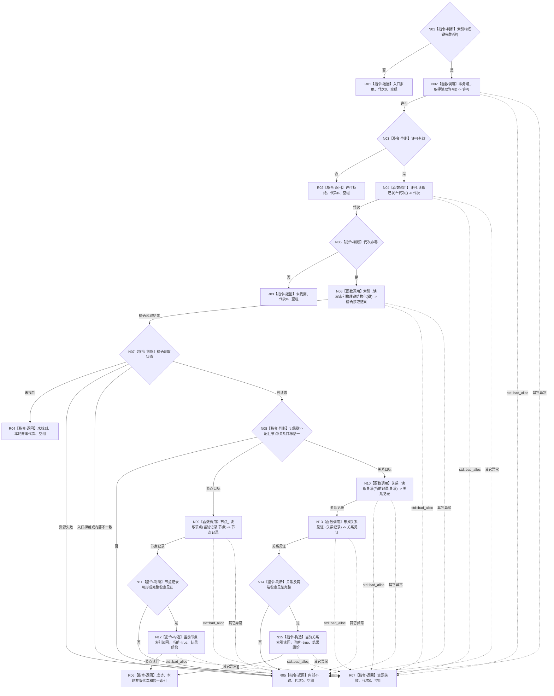

# 节点直接结构查询服务读取当前索引函数流程图 v0.2

更新时间：2026-08-03

## 依据

```text
4010、4030、4200；WORLD-TREE-P1A2Q详细设计v0.2 §2.2—§4
```

## 身份与边界

本图是目标单函数施工图，只冻结待新增公开查询函数，不表示当前代码已实现。

## 函数合同

```text
根函数：节点直接结构查询服务::读取当前索引
归属模块 / 文件 / 层级：海中鱼巣.核心.服务.节点直接结构 / 核心/服务.节点直接结构.ixx / L1
现有或待新增：待新增
完整签名：节点直接索引读取结果 读取当前索引(const 索引物理键& 键) const
参数：键 -> const借用，只在本次同步调用内读取且不保存；任一必需字段为零即非法
返回结果：调用方拥有值；成功携带同代次恰一当前稳定目标；未找到携带同次非零代次和空组；其它状态代次0、空组
被调函数流程图：读取索引物理键结构化 -> 流程图/20260803_可重建索引仓库读取索引物理键结构化_函数流程图_v0.2.md
```

## 流程图



## 节点合同

| 节点 | 类型 | 参数 / 输入绑定 | 结果 / 输出绑定 | 事实读写 | 后继条件 | 验证 |
| --- | --- | --- | --- | --- | --- | --- |
| N01 | 本函数内判断 | `键` | 完整/非法 | 无 | 非法到R01；完整到N02 | 零字段组合零仓调用 |
| N02—N05 | 函数调用与判断 | `事务域_` | 共享许可、已发布代次 | 只读事务域 | 竞争到R02；零代次到R03；非零到N06 | 许可竞争、零代次 |
| N06—N08 | 函数调用与判断 | `键 -> 读取索引物理键结构化.键` | 结构化状态和内部记录 | 只读索引、节点或关系仓 | 未找到/资源/矛盾分别到R04/R07/R05 | 正向缺失、反向错配、目标悬空 |
| N09—N12 | 函数调用、判断和构造 | `当前记录.节点 -> 读取节点.句柄` | 节点记录 -> 稳定节点索引读回 | 只读节点仓；构造局部值 | 不完整到R05；完整到R06 | 节点版本、类型、键和当前标志 |
| N10—N15 | 函数调用、判断和构造 | `当前记录.关系 -> 读取关系.句柄`；`关系记录 -> 形成关系见证_.记录` | 关系及端点见证 -> 稳定关系索引读回 | 只读关系/节点仓；构造局部值 | 不完整到R05；完整到R06 | 关系版本、两端、顺序和当前标志 |
| R01—R07 | 本函数内返回 | 对应分支材料 | 合同允许的具名结果 | 零机器事实写入 | 函数结束 | 全状态、代次、载荷组合 |

## 关键边界

```text
只读取同一内存已发布代次；不反向扫描、不查SQL、不返回内部句柄。
共享许可覆盖索引与权威目标复核；所有异常在本函数边界结构化。
```


