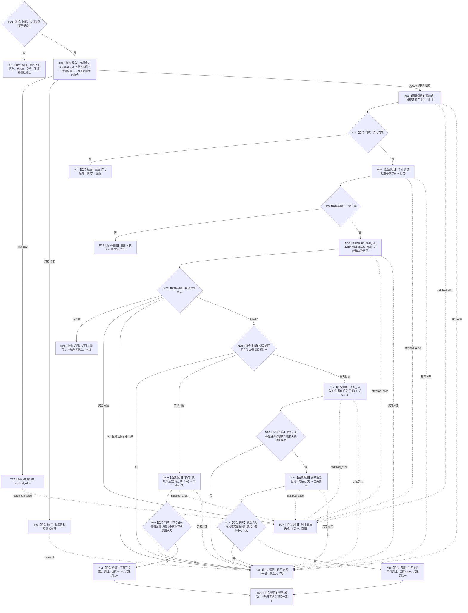

# 节点直接结构查询服务读取当前索引函数流程图 v0.3

更新时间：2026-08-03

## 依据

```text
4010、4030、4200
WORLD-TREE-P1A2Q 按精确索引键读取当前目标详细设计 v0.2 §2.2—§4
WORLD-TREE-P1A2Q 故障注入补充详细设计 v0.2 §2、§4
```

## 身份与边界

本图是目标单函数施工图。v0.3 在 v0.2 正常流程上补齐专项宏内的一次性异常/内部损坏谓词注入；测试模式只替换当前栈上的只读结果，不写事务域或仓库。

## 函数合同

```text
根函数：节点直接结构查询服务::读取当前索引
归属模块 / 文件 / 层级：海中鱼巣.核心.服务.节点直接结构 / 核心/服务.节点直接结构.ixx / L1
现有或待新增：待新增；执行侧已有未提交 WIP 不替代正式实现结果
完整签名：节点直接索引读取结果 读取当前索引(const 索引物理键& 键) const
参数：键 -> const 借用，只在本次同步调用内读取且不保存；任一必需字段为零即非法
返回结果：调用方拥有值；成功携带同代次恰一当前稳定目标；未找到携带同次非零代次和空组；其它状态代次0、空组
被调函数流程图：读取索引物理键结构化 -> 流程图/20260803_可重建索引仓库读取索引物理键结构化_函数流程图_v0.3.md
```

## 流程图



图中的“其它异常”实际由统一 `catch (...)` 进入 R05；只有 `std::bad_alloc` 进入 R07。

## 节点合同

| 节点 | 类型 | 参数 / 输入绑定 | 结果 / 输出绑定 | 事实读写 | 后继条件 | 验证 |
| --- | --- | --- | --- | --- | --- | --- |
| N01 / R01 | 本函数内判断 / 返回 | `键` | 完整性或入口拒绝 | 无 | 非法直接返回；合法到 T01 | 非法键不消费注入，零仓调用 |
| T01—T03 | 本函数内读取 / 抛出 | 本实例宏内原子测试字段 | 当前栈局部模式或测试异常 | 只消费测试指令；不读写机器事实 | 异常到统一 catch；其它到 N02 | 一次性、跨实例隔离、宏关闭零实体 |
| N02—N05 | 函数调用 / 判断 | `事务域_` | 共享许可与已发布代次 | 只读事务域 | 竞争到 R02；零代次到 R03；非零到 N06 | 许可覆盖全部后继读取 |
| N06—N08 | 函数调用 / 判断 | `键 -> 读取索引物理键结构化.键` | 结构化状态与内部记录 | 只读索引仓 | 状态映射或分支到目标读取 | 不反向扫描，不查 SQL |
| N09—N11 | 函数调用 / 判断 / 构造 | 节点内部句柄；局部模式 | 稳定节点索引读回 | 只读节点仓；构造局部值 | 读回缺失到 R05；完整到 R06 | 节点缺失模式命中原失败判断 |
| N12—N16 | 函数调用 / 判断 / 构造 | 关系内部句柄、关系记录；局部模式 | 稳定关系及端点见证 | 只读关系/节点仓；构造局部值 | 关系或端点缺失到 R05；完整到 R06 | 两种关系模式分别覆盖 N13/N15 |
| R02—R07 | 本函数内返回 | 对应分支材料 | 合同允许的具名结果 | 无 | 函数结束 | 注入后第二次同输入恢复正常；代次/六仓导出不变 |

## 关键边界

```text
测试模式只替换当前栈上的只读结果，不写节点、关系、索引或事务域。
模式与真实目标种类不匹配属于自检夹具错误，不可计入相应具名场景。
宏关闭时测试枚举、字段、设置函数和分支均不存在。
共享许可覆盖索引与权威目标复核；不反向扫描、不查 SQL、不返回内部句柄。
```
