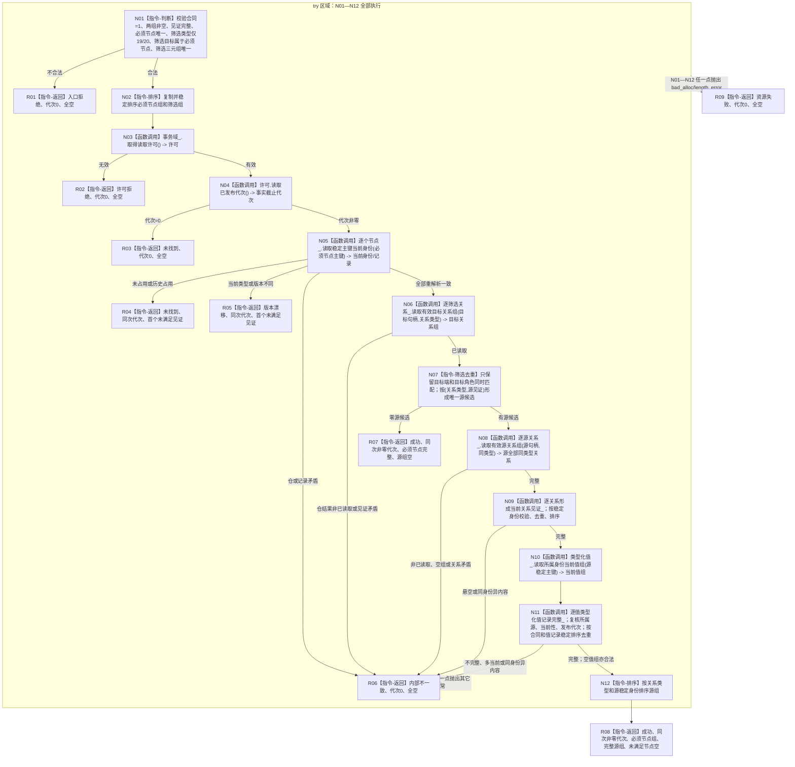

# 节点直接结构查询服务读取目标角色命中源的当前关系与类型化值函数流程图 v0.1

更新时间：2026-08-03

## 依据

```text
规范/4010_子规范_统一仓库稳定句柄与通用关系索引边界.md v1.2 §6.1
规范/4020_子规范_领域类型化数据记录与组合读取投影边界.md
规范/4210_子规范_动态信息分层获取与聚合_20260720.md §2.1—§2.2
规范/详细设计/20260803_WORLD-TREE-P1B-M_关系目标反向源同许可投影详细设计_v0.1.md
```

## 身份与边界

正式目标单函数施工图；根函数属于 L1 业务中性组合读取，不解释关系19/20角色、状态、动态、时间或基数，不写机器事实。

## 函数合同

```text
根函数：节点直接结构查询服务::读取目标角色命中源的当前关系与类型化值
归属模块 / 文件 / 层级：海中鱼巣.核心.服务.节点直接结构 / 海中鱼巣/核心/服务.节点直接结构.ixx / L1
现有或待新增：待新增；扩展既有类，不建立第二服务或方向重载
完整签名：节点直接目标角色源投影结果 节点直接结构查询服务::读取目标角色命中源的当前关系与类型化值(const 节点直接目标角色源投影请求& 请求) const noexcept
参数：调用方拥有并 const 借用；服务不保存；只含合同版本、必须节点见证和目标角色筛选
返回结果：调用方拥有值；成功携带一个非零事实截止、重新解析的必须节点、源组；未找到/版本漂移可携带首个未满足节点，其它非成功载荷全空
被调函数流程图：P1A2G 已有私有关系见证和类型化值完整性纯函数由本函数复用，不建立公开被调根
```

## 流程图



## 节点合同

| 节点组 | 类型 | 输入 / 输出 | 事实读写 | 核心验证 |
| --- | --- | --- | --- | --- |
| N01—N02 | 本函数内判断/排序 | 公开请求 -> 已准入稳定顺序副本 | 无 | 非法入口在取得许可前结束 |
| N03—N05 | 函数调用 | 必须节点见证 -> 同许可当前节点 | 只读内存已发布事实 | 许可恰一次；首个未满足稳定 |
| N06—N07 | 函数调用+筛选 | 目标筛选 -> 唯一 `(类型,源)` 候选 | 只读关系仓 | 只反向发现源，不解释角色 |
| N08—N11 | 函数调用+校验 | 源 -> 全关系与源当前值 | 只读关系/值仓 | 不丢弃未命中角色；空值组合法 |
| N12/R08 | 本函数内排序/返回 | 完整材料 -> 调用方值式结果 | 无 | 一个非零事实截止；无句柄/许可外泄 |
| R01—R09 | 本函数内返回 | 具名状态 | 无 | 非成功不返回部分业务载荷 |

## 关键边界

```text
P1A2G：已知源根 -> 第一跳 -> 中间相关关系 -> 关系目标值。
P1B-M：已知关系目标 -> 目标角色反向发现源 -> 源全部同类型关系 -> 源自身当前值。
两者不可互换；不得修改P1A2G请求/结果或新增方向参数。P1B-Q负责关系19/20角色、基数、时间和值域；本函数不按发生时间排序、不形成状态/动态成功。
```
