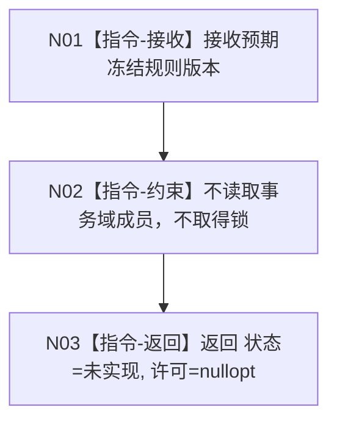
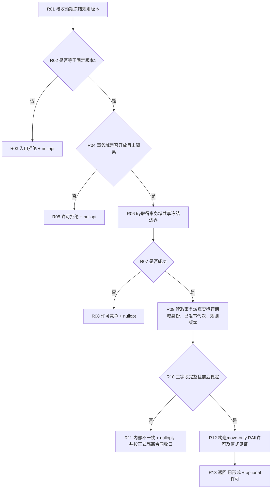

# 节点直接身份结构事务域::取得统一冻结许可 函数流程图 v0.2

创建侧正式基线：`30dc5df188ecc0b2f1cb7e0c719fbe21dbdb1803`

最终签名：

```cpp
节点直接统一冻结许可取得结果 取得统一冻结许可(
    std::uint32_t 预期冻结规则版本) const;
```

## 身份与边界

```text
根函数：节点直接身份结构事务域::取得统一冻结许可
归属模块 / 文件 / 层级：海中鱼巣.核心.执行器.节点直接身份结构写入 / 海中鱼巣/核心/执行器.节点直接身份结构写入.ixx / L1核心事务域
现有或待新增：待新增；F0只建立最终ABI和固定未实现骨架
参数：预期冻结规则版本 / std::uint32_t / 值传入 / 调用期有效；F0不解释其数值
返回结果：节点直接统一冻结许可取得结果；F0固定为状态未实现、许可nullopt
被调函数流程图：F0无被调函数；R1调用链须在R1设计中原位补齐
```

## F0安全骨架



F0对零、1、其它版本以及任意事务域状态均返回同一未实现空结果；调用前后普通已发布代次、隔离、入口开放和仓事实逐字段不变。

## R1真实实现后继的冻结流程

以下流程是R1必须满足的最终行为轮廓，不授权F0提前实现未裁决字段：



## 结果不变量

| 状态 | 许可 | 见证可读 | 事务事实变化 |
| --- | --- | --- | --- |
| `已形成` | 必有且有效 | 域身份/代次/规则均非零 | 0 |
| `入口拒绝/许可拒绝/许可竞争/资源失败/未实现/内部不一致` | 必空 | 否 | 0；内部不一致是否隔离由R1正式裁决 |

`冻结许可属于本域(const 节点直接统一冻结许可&)` 只比较许可内部不可伪造的域归属与当前事务域真实身份；不得比较调用方输入、公开见证数值、对象地址或已发布代次。

配套的 `节点直接类型化值冻结只读访问器::观察已发布结构(许可)` 是4170复制后复核所需的轻量根：F0固定返回未实现空观察；R1只返回同一许可见证、当前真实结构版本和记录数量，不返回或复制记录组。

## F0节点合同

| 节点 | 类型 | 参数 / 输入绑定 | 结果 / 输出绑定 | 事实读写 | 后继条件 | 验证 |
| --- | --- | --- | --- | --- | --- | --- |
| N01 | 本函数内指令 | 调用实参 -> `预期冻结规则版本` | 局部只读形参 | 无 | 无条件 | 0、1、其它版本均覆盖 |
| N02 | 本函数内指令 | 形参存在但不读取事务域成员 | 无 | 0锁、0成员、0仓读取 | 无条件 | 静态调用边为0 |
| N03 | 本函数内指令 | 无 | `节点直接统一冻结许可取得结果{未实现,nullopt}` | 0机器事实变化 | 返回 | 前后权威状态逐字段相等 |
