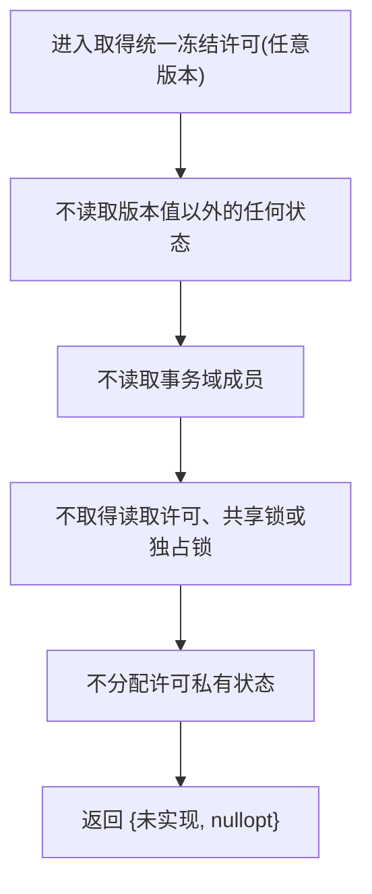
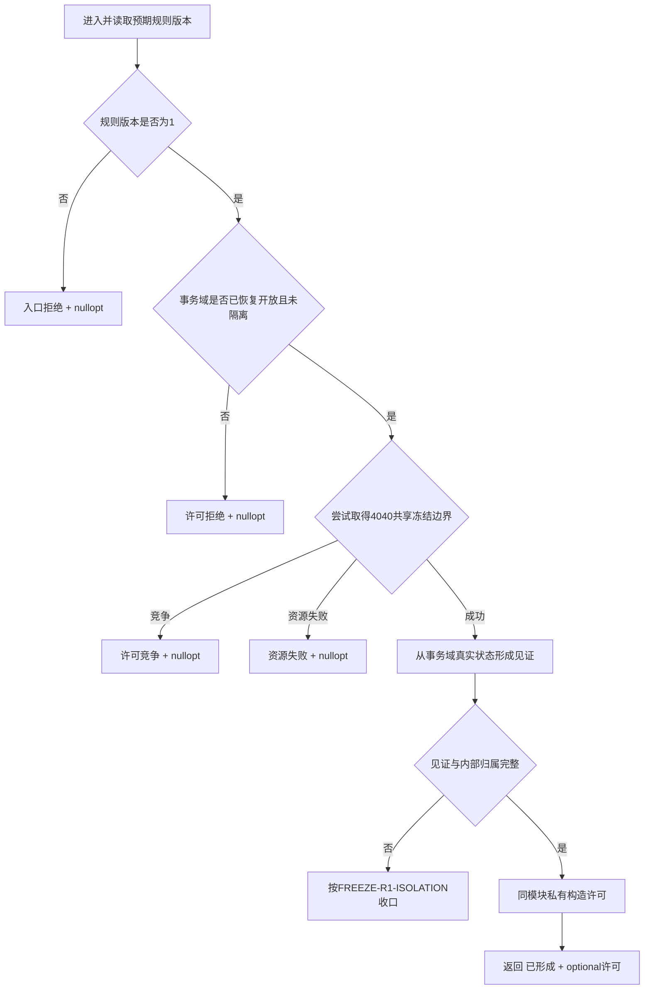

# 节点直接身份结构事务域::取得统一冻结许可 函数流程图 v0.3

修订基线：`dd497341216b05e2d4b55af6afa1df5402882cc3`

本图不可变替换 v0.2 的物理所有权说明。函数签名、F0 固定未实现行为和 R1 目标语义不变。

## 函数合同

```cpp
节点直接统一冻结许可取得结果
节点直接身份结构事务域::取得统一冻结许可(
    std::uint32_t 预期冻结规则版本) const;
```

唯一物理位置：`海中鱼巣/核心/执行器.节点直接身份结构写入.ixx`，事务域现有 public 区。

统一冻结许可、见证、状态和取得结果也由该执行器模块唯一声明；许可 private friend 与事务域同模块。其它命名模块不得前置声明事务域或许可。

## F0 施工流程



逐节点分析：

| 节点 | 输入来源 | 调用 / 状态 | 输出与失败 |
| --- | --- | --- | --- |
| A | 调用方的 `预期冻结规则版本` | 仅进入函数 | 任意数值走同一路径 |
| B | 无 | 不做版本裁决 | 不产生入口拒绝或已形成 |
| C | 无 | 事务域成员读取 0 次 | 域状态不变 |
| D | 无 | 许可 / 锁调用 0 次 | 无竞争、无等待 |
| E | 无 | 分配 0 次 | 无资源失败分支 |
| F | 编译期常量 | 构造结构化结果 | `状态=未实现`、许可空 |

F0 函数功能确认：这是最终 ABI 的安全失败根，不是许可提供者完成证明。诊断责任为“向上送出结构化未实现”；不记录日志。

## R1 目标流程



R1 数据来源：

| 字段 | 唯一来源 | 禁止来源 |
| --- | --- | --- |
| 运行期域身份 | `FREEZE-R1-DOMAIN-ID` 正式裁决后的事务域真实状态 | 地址、随机猜测、调用方输入、SQL |
| 已发布代次 | 同一共享冻结边界内的事务域当前已发布代次 | 最大记录版本、日志、缓存 |
| 冻结规则版本 | 编译期常量 1 | 调用方回显 |
| 内部归属 | 许可私有状态中的同域不可伪造材料 | 公开见证数值、对象地址比较 |

## 同模块构造证明

```text
执行器模块首次且唯一声明事务域
-> 同模块首次且唯一声明统一冻结许可
-> 许可 private friend 指向同模块已声明事务域
-> 事务域成员可调用许可私有构造
-> 无第二命名模块声明、无 import 环、无公开构造面
```

配套 `冻结.节点直接类型化值` 模块的两个访问根只消费许可公开引用，不构造许可、不声明事务域。F0 固定未实现；R1 在协调方已完成所属域验证后形成类型化值副本和轻量观察。
