# 节点直接身份结构写入执行器执行带参与者类型化结构事务函数流程图 v0.1

更新时间：2026-08-03

## 依据

```text
目标业务图：流程图/20260803_WORLD-TREE-FEATURE-W-MC_类型化结构事务参与者桥接业务流程图_v0.1.md
详细设计：规范/详细设计/20260803_WORLD-TREE-FEATURE-W-MC_类型化结构事务参与者桥接详细设计_v0.1.md
当前实现基线：4232074bafbcc0bb01ccad7b739851e9af547a36
当前函数：节点直接身份结构写入执行器::执行类型化结构事务_(请求, 允许空域治理)
```

## 身份与边界

正式目标单函数施工图。唯一根函数是待修改的执行器私有主算法；公开旧单参入口和新增带 `span` 重载都只负责形成参数并调用本根函数。

## 函数合同

```cpp
节点直接类型化结构数据操作结果
节点直接身份结构写入执行器::执行带参与者类型化结构事务_(
    const 节点直接类型化结构数据操作请求& 请求,
    bool 允许空域治理,
    std::span<节点直接类型化结构事务参与者* const> 参与者组) const;
```

参数：

| 参数 | 类型 / 方向 | 所有权与生命周期 | 非法值 |
| --- | --- | --- | --- |
| `请求` | `const ...&` 输入 | 调用方拥有；本次同步调用内只读借用 | 版本、身份、摘要、预期代次或写集不满足现行 P1A2 合同 |
| `允许空域治理` | `bool` 输入 | 值式 | `true` 只允许恢复专用空域治理入口；非空参与者组与 `true` 同时出现固定拒绝 |
| `参与者组` | `span<节点直接类型化结构事务参与者* const>` 输入 | 调用方拥有参与者对象和地址数组；必须覆盖整个同步调用；执行器不保存地址 | 任一空指针、重复地址；空组合法 |

返回：保持现行 `节点直接类型化结构数据操作结果` 八状态数值和全部读回字段。参与者私有材料不进入返回结构。参与者非成功按详细设计映射；撤销/最后发布无法完整收口时固定 `内部不一致` 并隔离。

## 流程图

```mermaid
flowchart TD
    N01["N01【指令-判断】检查类型化结构有效、请求静态完整、允许空域治理与参与者组组合合法"] --> N02{"N02【指令-判断】入口是否完整"}
    N02 -- "否" --> R01["R01【指令-返回】返回入口拒绝；参与者调用次数0"]
    N02 -- "是" --> N03["N03【函数调用】有效类型化结构参与者组_(参与者组) -> 组有效"]
    N03 --> N04{"N04【指令-判断】组有效"}
    N04 -- "否" --> R01
    N04 -- "是" --> N05["N05【函数调用】事务域_->取得独占许可() -> 许可"]
    N05 --> N06{"N06【指令-判断】许可是否有效"}
    N06 -- "否" --> R02["R02【指令-返回】返回许可拒绝；零参与者调用"]
    N06 -- "是" --> N06A{"N06A【指令-判断】核心幂等仓是否已有同一事务身份记录"}
    N06A -- "同义已发布" --> R07["R07【指令-返回】返回核心原幂等读回；零参与者调用"]
    N06A -- "异义/待发布" --> R08["R08【指令-返回】返回幂等冲突或内部不一致；零参与者调用"]
    N06A -- "未找到" --> N06B{"N06B【指令-判断】当前代次是否等于请求预期"}
    N06B -- "否" --> R09["R09【指令-返回】返回版本漂移；零参与者调用"]
    N06B -- "是" --> N07["N07【函数调用】形成计划身份映射_(请求) -> 计划映射"]
    N07 --> N08["N08【函数调用】编码写集_并调用持久证据_->准备(...) -> 持久准备结果"]
    N08 --> N09{"N09【指令-判断】持久准备成功且临时侧账建立"}
    N09 -- "否" --> R03["R03【指令-返回】沿既有持久失败合同返回或隔离"]
    N09 -- "是" --> N10["N10【指令-分支】按现行写集形状形成全部业务候选；保持零确认"]
    N10 --> N10A["N10A【指令-构造】从未发布候选值式见证形成读回、结果摘要和核心幂等候选；保持零确认"]
    N10A --> N11{"N11【指令-判断】业务候选、结果摘要与核心幂等候选是否完整"}
    N11 -- "否" --> N20["N20【函数调用】逆序撤销类型化结构参与者组_(已触及数量, 参与者组) -> 参与者撤销完整"]
    N11 -- "是" --> N12["N12【指令-构造】构造节点直接类型化结构提交准备只读视图(事务序号, 当前代次, 目标代次, 请求, 局部身份见证组, 候选读回)"]
    N12 --> N13["N13【函数调用】调用第k项前计入已触及数量；按登记顺序安全准备类型化结构参与者_(视图, 参与者组) -> 首次状态与已触及数量"]
    N13 --> N14{"N14【指令-判断】全部参与者已准备"}
    N14 -- "否" --> N20
    N14 -- "是" --> N15["N15【指令-循环】按详细设计§5逐分支确认业务候选，再确认核心幂等候选"]
    N15 --> N16{"N16【指令-判断】核心确认完整"}
    N16 -- "否" --> N20
    N16 -- "是" --> N17["N17【函数调用】按登记顺序安全确认类型化结构参与者_(参与者组) -> 首次状态"]
    N17 --> N18{"N18【指令-判断】全部参与者已确认"}
    N18 -- "否" --> N20
    N18 -- "是" --> N19["N19【最后发布指令】按详细设计§5逐分支完成业务候选，再完成核心幂等候选发布"]
    N19 --> N25["N25【函数调用】按登记顺序安全完成类型化结构参与者发布_(参与者组) -> 发布完整"]
    N25 --> N26{"N26【指令-判断】最后发布完整"}
    N26 -- "否" --> N27["N27【函数调用】许可.标记隔离()"]
    N27 --> R04["R04【指令-返回】返回内部不一致；不得撤销已完成发布候选"]
    N26 -- "是" --> N28["N28【函数调用】事务域_->推进普通已发布代次(许可, 当前代次) -> 推进成功"]
    N28 --> N29{"N29【指令-判断】代次推进与发布后读回完整"}
    N29 -- "否" --> N27
    N29 -- "是" --> N30["N30【函数调用】持久证据_->标记已发布(...)并更新持久状态"]
    N30 --> R05["R05【指令-返回】返回已提交及现行核心读回"]
    N20 --> N20A["N20A【函数调用】撤销核心幂等候选；不存在时按完整处理"]
    N20A --> N21["N21【指令-循环】按详细设计§5逐分支依赖逆序撤销全部业务候选"]
    N21 --> N21A{"N21A【指令-判断】参与者、幂等候选和业务候选是否全部撤销成功"}
    N21A -- "否或结果未知；保留临时侧账" --> N27
    N21A -- "是" --> N22["N22【函数调用】持久证据_->标记已撤销未发布(...)并清除临时侧账"]
    N22 --> N23{"N23【指令-判断】见证和清账是否完整"}
    N23 -- "是" --> R06["R06【指令-返回】返回首次非成功状态；代次不变"]
    N23 -- "否或结果未知；保留可恢复侧账" --> N27
```



## 节点合同

| 节点 | 类型 | 参数 / 输入绑定 | 结果 / 输出绑定 | 事实读写 | 后继条件 | 验证 |
| --- | --- | --- | --- | --- | --- | --- |
| N01—N04 | 判断 / 函数调用 | 请求、允许空域治理、参与者组 | 入口分类 | 无 | 合法才取许可 | MC-A01—A03 |
| N05—N09 | 函数调用 / 判断 | 请求预期代次、摘要、持久材料 | 许可、计划映射、尝试序号 | 取得独占许可；持久准备 | 完整才形成候选 | 既有 P1A2 回归 + MC-A04 |
| N10—N13 | 分支 / 构造 / 函数调用 | 各分支业务候选、纯值映射、幂等计划 | 未确认业务/幂等候选、只读视图、已触及数量 | 所有核心候选仍未普通可见 | 幂等候选形成后才准备；准备完成才确认 | MC-A04—A06、A12 |
| N15—N18 | 循环 / 调用 | 已准备候选 | 核心与参与者确认状态 | 候选状态变为确认待发布 | 全部确认才进最后发布 | MC-A07—A08 |
| N19、N25—N30 | 最后发布 / 调用 / 判断 | 全部已确认候选 | 发布结果、目标代次 | 完成发布；最后推进事务域代次 | 推进成功后读回 | MC-A09—A11 |
| N20—N23 | 调用 / 循环 / 判断 | 首次失败、已触及数量 | 完整撤销或隔离 | 已触及参与者逆序、幂等候选、业务候选逆序；仅三类撤销全成功才写未发布见证并清账 | 见证和清账也完整才返回首次状态，否则保留可恢复侧账并隔离 | MC-A06—A09、A12 |

## 关键边界

```text
只读视图及其任何引用只在准备回调期间有效，参与者不得保存地址或引用。
参与者不得从视图取得事务许可、仓库、会话、锁、可写候选或持久端口。
现行每一个真实写集分支都必须接入相同准备/确认/撤销/最后发布助手；遗漏任一分支即失败。
第 k 个参与者一经开始调用准备就计入已触及前缀；其准备返回失败或抛异常也必须接受完成撤销并清除部分候选。
任一参与者、幂等候选或业务候选撤销失败/未知时禁止写已撤销未发布见证和清账；只有三类全部撤销成功才调用持久端口，持久见证或清账失败也必须隔离并保留可恢复侧账。
六个非空业务分支必须先形成业务候选和幂等候选，再准备参与者；参与者失败时先撤参与者、再撤幂等候选、最后按分支逆序撤业务候选。
核心幂等读回不重放参与者；调用方必须把参与者完整语义纳入请求意图摘要，并在领域层互证原参与者事实。
已完成最后发布后不存在业务撤销；异常只能隔离并阻止代次推进。
```

## 双向引用

- 调用方图：[节点直接类型化结构数据操作提交带参与者事务](20260803_节点直接类型化结构数据操作提交带参与者事务_函数流程图_v0.1.md)
- 业务图：[WORLD-TREE-FEATURE-W-MC 类型化结构事务参与者桥接](20260803_WORLD-TREE-FEATURE-W-MC_类型化结构事务参与者桥接业务流程图_v0.1.md)
