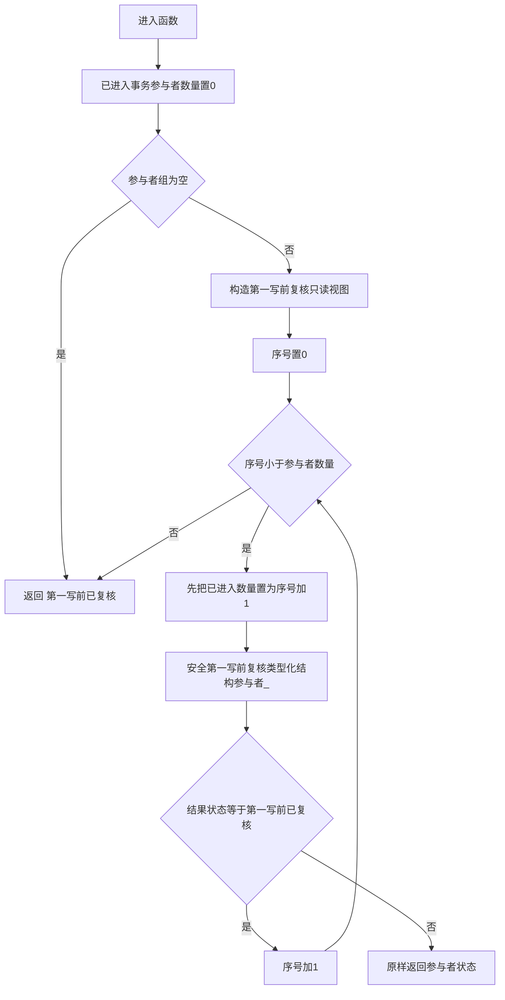

# 节点直接身份结构写入执行器::第一写前复核类型化结构参与者组_ 函数流程图 v0.1

日期：2026-08-03
创建侧正式代码基线：`9e9964693019c1827649224c92565d95e0b4504c`

## 1. 冻结签名

```cpp
static 节点直接类型化结构事务参与者状态
第一写前复核类型化结构参与者组_(
    const 节点直接类型化结构数据操作请求& 请求,
    std::uint64_t 事务序号,
    std::uint64_t 当前事实截止代次,
    std::span<节点直接类型化结构事务参与者* const> 参与者组,
    std::size_t& 已进入事务参与者数量) noexcept;
```

该私有静态函数只编排参与者调用，不读取核心仓，不取得或暴露许可，不形成候选，不执行撤销。撤销由调用分支复用现有 `逆序撤销类型化结构参与者组_` 完成。

## 2. 流程



## 3. 视图构造

```cpp
const 节点直接类型化结构第一写前复核只读视图 视图(
    事务序号,
    当前事实截止代次,
    当前事实截止代次 + 1,
    请求);
```

视图只有四个读取面：事务序号、当前事实截止代次、目标发布代次和原不可变请求引用。它没有候选读回和计划身份见证，也没有仓、许可或锁访问器。

## 4. 异常和撤销边界

`安全第一写前复核类型化结构参与者_` 捕获全部异常并返回 `内部不一致`。组函数在调用当前参与者前推进计数，因此第一项失败也得到计数1，当前失败项会被外层逆序撤销。组函数不吞并参与者返回的 `入口拒绝`、`版本漂移`、`许可拒绝` 或 `资源失败`；外层继续复用现有映射函数。

预复核全部成功后计数等于参与者组大小。该计数贯穿候选建立、准备、确认前的全部失败路径，不能在进入 `准备类型化结构参与者组_` 前清零或缩小；这样候选建立失败也会撤销只经历预复核的参与者。

## 5. 禁止实现

- 不得给参与者虚函数提供默认成功实现。
- 不得把预复核并入 `准备提交` 或在候选形成后才调用。
- 不得因参与者未形成私有候选而跳过 `完成撤销`。
- 不得让本函数直接隔离事务域；隔离由持有许可的外层失败收口负责。
