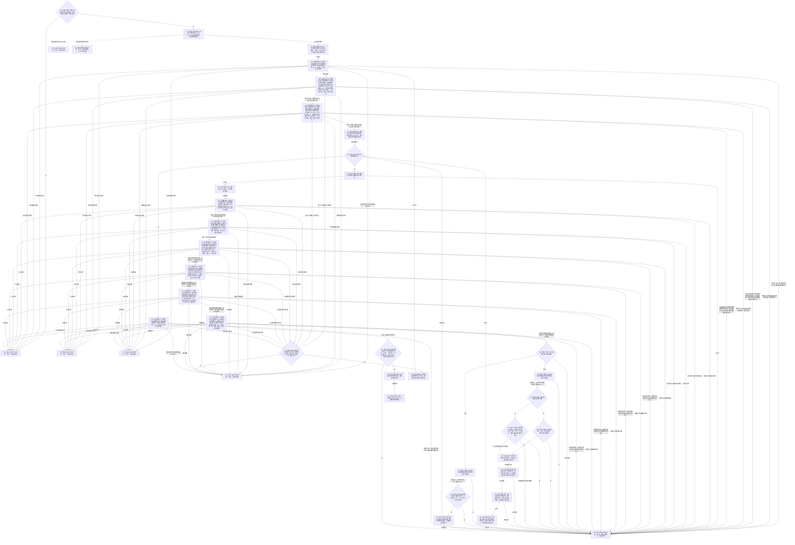

# 读取世界结构函数流程图 v0.2

更新时间：2026-08-03

## 依据

```text
4200 v0.8；业务节点到能力与目标函数映射.md“世界事实维护”；WORLD-TREE-P1业务流程图Q01/Q02；P1A3F详细设计v0.1未替换段+v0.2；P1A3详细设计v0.2 §4.2/§5；P1A2节点/关系/类型合同/类型化值/代次公开查询合同
```

## 身份与边界

目标单函数施工图；一图唯一根函数。本函数从一个具名世界根向下遍历当前直接世界结构，只消费 L1 值式查询；不取得仓库、许可或事务，不写事实。

## 函数合同

```text
根函数：节点直接世界结构读取服务::读取世界结构
归属模块 / 文件 / 层级：海中鱼巣.领域.服务.节点直接世界结构 / 海中鱼巣/领域/服务.节点直接世界结构.ixx / L2
现有或待新增：P1A3F v0.2 骨架原位替换为真实行为
完整签名：世界结构读取结果 节点直接世界结构读取服务::读取世界结构(const 节点直接世界结构读取请求& 请求) const
参数：请求为const借用，只在同步调用内存续；合同/规则版本必须当前，世界根见证必须完整且类型=场景；不保存引用
返回结果：调用方拥有的值；只有已读取携带非零代次和完整稳定排序世界结构；非成功不携带部分场景/存在事实
被调函数流程图：无新增目标图；六个被调L1查询是已冻结提供者
```

## 流程图



## 节点合同

| 节点 | 类型 | 参数 / 输入绑定 | 结果 / 输出绑定 | 事实读写 | 后继条件 | 验证 |
| --- | --- | --- | --- | --- | --- | --- |
| N01/T01/N02 | 本函数内判断/异常边界/赋值 | 请求及其版本/根见证 | 轮次与空局部材料 | 零写入 | 入口成立到N03；受保护体异常到E01/E02 | 非当前版本、无效根、非场景根、两类异常 |
| N03/N40 | 函数调用 | 无实参→无形参 | 首/末代次结果 | 只读当前已发布代次 | 状态分流或漂移 | 成功必须非零；未找到必须零；其它非成功必须零；非法组合到R05 |
| N04 | 函数调用 | `世界场景资格类型合同->合同身份`；`1->合同版本` | 场景合同结果 | 只读场景合同 | 字段全等到N05 | 成功携带非零当前代次和完整合同；未找到可携带当前非零代次但因合同必需而到R05；其它非成功必须代次0；命名空间、表示、值域1..3、所有者、生命周期/兼容组 |
| N05 | 函数调用 | `世界存在资格类型合同->合同身份`；`1->合同版本` | 存在合同结果 | 只读存在合同 | 字段全等到N06 | 成功携带非零当前代次和完整合同；未找到可携带当前非零代次但因合同必需而到R05；其它非成功必须代次0；值域1..2、所有者=存在服务 |
| N06—N09 | 本函数内队列/集合指令 | 根见证或小根堆顶 | 当前访问项和已访问登记 | 只改局部容器 | 重复展开拒绝 | 稳定主键小根堆、已访问/已排队互斥 |
| N10 | 函数调用 | `当前主键->主键` | 当前节点结果 | 只读节点 | 见证同义到N11 | 成功携带同轮非零代次和完整节点；未找到可携带当前非零代次并映射漂移；其它非成功必须代次0；类型/主键/版本逐字段同义 |
| N11 | 函数调用 | `当前主键->所属身份` | 当前资格值组 | 只读类型化值 | 必需非空到N12 | 成功携带同轮非零代次；未找到可携带当前非零代次但不是合法空资格；其它非成功必须代次0 |
| N12—N15 | 四次独立函数调用 | `当前主键->源/目标`；`普通父子/归属->类型` | 入/出父子及入/出归属结果 | 只读关系 | 成功非空或未找到空组到N16 | 成功非空或未找到空组都必须携带当前非零代次；未找到非空/代次0及其它非法组合到R05；每个位置再独立裁决空关系是否合法 |
| N16/N20—N27 | 本函数内判断/筛选/登记/入队 | 场景节点、资格和四组关系 | 场景事实、关系表和新待访问项 | 只改局部材料 | 单父/无环/端点成立回N07 | 根空入边、非根恰一父、初始场景直属根、出边端点类型 |
| N30—N32 | 本函数内筛选/判断/登记 | 存在节点、资格和四组关系 | 存在事实和归属关系登记 | 只改局部材料 | 单归属成立回N07 | 资格恰一/正确来源，入归属恰一，其它三关系组为空 |
| N41—N42 | 本函数内判断/排序 | 全部局部材料 | 完整稳定排序结构 | 零权威写入 | 全不变量成立到R06 | 唯一初始场景、正反关系闭合、堆/排队集合空 |
| D01—D02 | 本函数内判断/赋值 | 仅成功/合法空结果间的代次不等 | 第二轮空局部材料 | 丢弃局部副本 | 首轮才重试 | 未找到必需事实/许可/资源/内部错误不重试 |
| R01—R06/E01—E02 | 本函数内返回 | 具名分支材料 | 合同允许的值式结果 | 零补写 | 函数结束 | 只有R06携带非零代次和完整结构；异常不越界 |

## 关键边界

```text
合法空关系必须是 L1 返回“未找到+空组+同一非零代次”，并且当前节点结构位置允许该空组；不把必需节点、资格或非根入边未找到当作合法空。
同一关系从源向和目标向第二次出现是正反闭合，不是重复错误；只有同稳定主键但字段不同才是内部不一致。
只有合法成功/空组读取之间的代次不等进入恰一次完整重试；许可拒绝、资源失败、必需未找到和内部不一致直接返回。
std::bad_alloc在本L2边界映射资源失败；其它异常映射内部不一致；不使用SQL、句柄、显示名或容器迭代顺序补判。
```
