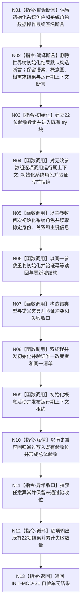

# 运行系统角色初始化自检退出旧世界类型依赖函数流程图 v0.1

更新时间：2026-08-03

## 依据

```text
海中鱼巣/自检.系统角色初始化.ixx @ b8404079aaed5b6012fbe459526f5491fb8921af
规范/4200_子规范_世界树业务服务与同代次完整事实快照.md §1、§10
流程图/20260803_WORLD-TREE-P1D-MIG-SYSROLE-TEST_系统角色自检旧世界类型退出业务流程图_v0.1.md
```

## 身份与边界

本图是目标单函数施工图。唯一变化位于函数入口的编译期合同区：删除 `世界树初始化结果` 默认构造断言。函数签名、参数使用、运行时22项验收、返回结构和异常收口全部保持当前实现。

## 函数合同

```text
根函数：运行系统角色初始化自检
归属模块 / 文件 / 层级：海中鱼巣.自检.系统角色初始化 / 海中鱼巣/自检.系统角色初始化.ixx / 自检
现有或待新增：现有；只删除一条过期编译期断言
完整签名：自检单元结果 运行系统角色初始化自检(bool 历史兼容回归通过)
参数：历史兼容回归通过；bool；按值输入；仅供既有验收[18]与总体验收使用；本叶不改变语义
返回结果：自检单元结果；保持身份 INIT-MOD-S1、名称、通过位、22项数量和失败数量计算不变
被调函数流程图：无新增；既有运行时调用边全部保持
```

## 流程图



## 节点合同

| 节点 | 类型 | 参数 / 输入绑定 | 结果 / 输出绑定 | 事实读写 | 后继条件 | 本叶验证 |
| --- | --- | --- | --- | --- | --- | --- |
| N01 | 编译期指令 | 当前正式接口 | 两条现行签名断言 | 无 | 编译成立 | 逐字保留 |
| N02 | 编译期指令 | 五条默认构造/复制合同 | 删除旧世界一条，其余不变 | 无 | 编译成立 | 目标类型零命中 |
| N03 | 本函数内指令 | 无 | 22位数组 | 隔离自检局部状态 | 进入既有矩阵 | 数量22不变 |
| N04 | 函数调用组 | 无效参数组 | 写前拒绝材料 | 仅隔离上下文 | 全部完成 | 既有A02 |
| N05 | 函数调用组 | 主参数 | 首次清单与稳定身份读回 | 隔离上下文 | 调用完成 | 既有A01/A03—A09 |
| N06 | 函数调用组 | 同一主参数 | 幂等读回 | 隔离上下文 | 调用完成 | 既有A10 |
| N07 | 函数调用组 | 冲突夹具 | 结构化冲突/失败收口 | 隔离上下文 | 调用完成 | 既有A11/A13 |
| N08 | 函数调用组 | 同一并发参数 | 两结果与唯一改变次数 | 隔离上下文 | 两线程连接 | 既有A12 |
| N09 | 函数调用组 | 概念活动参数、上下文 | 发布状态与租约 | 隔离宿主 | 调用完成 | 既有A14—A18 |
| N10 | 本函数内指令 | `历史兼容回归通过` | 既有验收位 | 无机器事实 | 赋值完成 | 参数引用不变 |
| N11 | 本函数内指令 | 任意异常 | 默认失败位 | 无新增事实 | 总是进入汇总 | catch保持 |
| N12 | 本函数内指令 | 22位数组 | 失败数量 | 人读输出，不裁决机器事实 | 循环结束 | 输出项数22 |
| N13 | 本函数内指令 | 汇总值 | `自检单元结果` | 无 | 返回 | 身份/名称/数量不变 |

## 关键边界

```text
删除断言不等于证明旧世界类型错误，只证明该类型不属于本专项自检合同。
不新增任何函数、DTO、模块、重载、适配壳或未实现结果。
运行时调用边、参数引用、验收索引和异常路径禁止变化。
```
