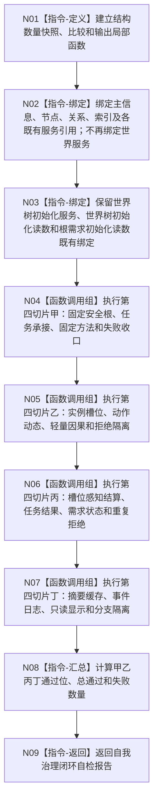

# 运行自我治理闭环自检退出旧世界服务引用函数流程图 v0.1

更新时间：2026-08-03

## 依据

```text
海中鱼巣/线程/自检.自我治理闭环.ixx @ b8dd29cdcda86fb88c0bee4a91467f5d637f817c
流程图/20260803_WORLD-TREE-P1D-MIG-SELF-CLOSURE-WORLD-REF_自我治理闭环自检旧世界服务引用退出业务流程图_v0.1.md
```

## 身份与边界

本图是目标单函数施工图。唯一函数内变化是删除 `auto& 世界 = 上下文.世界;`。该别名当前没有任何后继读取或调用；其余局部引用绑定、请求形成、四组验收、报告汇总和返回全部保持。

## 函数合同

```text
根函数：运行自我治理闭环自检
归属模块 / 文件：海中鱼巣.线程.自检.自我治理闭环 / 海中鱼巣/线程/自检.自我治理闭环.ixx
现有或待新增：现有；删除一个未使用局部引用
完整签名：自我治理闭环自检报告 运行自我治理闭环自检(const 自我治理闭环自检上下文& 上下文)
参数：上下文；const借用；调用期间有效；本叶删除其中世界字段后其余引用生命周期不变
返回：自我治理闭环自检报告；甲乙丙丁分组、总通过和失败数量算法不变
被调函数流程图：无新增；既有调用图全部保持
```

## 流程图



## 节点合同

| 节点 | 类型 | 输入 | 输出 | 事实读写 | 后继条件 | 本叶约束 |
| --- | --- | --- | --- | --- | --- | --- |
| N01 | 本函数内指令 | 无 | 三个局部辅助 | 仅局部 | 定义完成 | 不变 |
| N02 | 本函数内指令 | 上下文字段 | 服务/仓引用 | 无 | 绑定完成 | 只删除世界别名 |
| N03 | 本函数内指令 | 旧初始化服务与读数 | 局部引用 | 无 | 绑定完成 | 全部保留 |
| N04—N07 | 函数调用组 | 既有请求和隔离材料 | 四组验收位 | 既有自检事实 | 各组完成 | 调用顺序和次数不变 |
| N08 | 本函数内指令 | 全部验收位 | 汇总报告 | 无机器事实 | 汇总完成 | 算法不变 |
| N09 | 本函数内指令 | 报告 | 返回值 | 无 | 返回 | 类型不变 |

## 关键边界

```text
世界局部别名删除前后的运行时求值均为0；引用绑定本身不读取世界服务状态。
不得顺带删除世界树初始化服务、初始化读数或任何使用这些读数的分支。
不得新增占位世界服务、空函数、兼容字段或默认构造路径。
```
