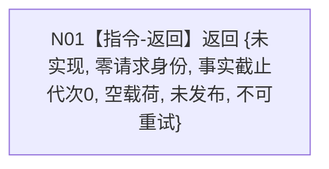

# 需求业务服务确认当前正差距函数流程图 v0.1

更新时间：2026-08-03

## 依据

```text
3100、4050、4180、5090、6180、8300、ACCEPTANCE-01
流程图/目标业务流程图/L2/BIZ-L2-004-01_确认当前正差距_目标函数流程图_v0.1.md
规范/详细设计/20260803_SELF-GOV-G05_正差距确认合同骨架详细设计_v0.1.md
```

## 身份与边界

正式目标单函数施工图。当前叶只实现最终 ABI 骨架；本图不冒充 BIZ-L2-004-01 的最终真实流程。

## 函数合同

```text
根函数：确认当前正差距
归属模块 / 文件 / 层级：海中鱼巣.领域.服务.需求 / 海中鱼巣/领域/服务.需求.ixx / L2
现有或待新增：待新增公开 const 成员函数，原位扩展既有需求业务服务
完整签名：需求正差距结果 需求业务服务::确认当前正差距(const 需求正差距请求& 请求) const
参数：请求为只读借用，调用期间有效；骨架不得读取任何字段
返回：固定按值返回 {未实现, 零请求身份, 0, nullopt, false, false}
被调函数流程图：无；项目内直接调用边固定为 0
诊断责任：无适用错误分支；骨架没有判断、异常捕获或诊断输出
类型依赖：import 海中鱼巣.领域.服务.特征比较；结果载荷直接拥有完整 特征比较结果，不建立简化副本
```

## 流程图



## 节点合同

| 节点 | 类型 | 参数 / 输入绑定 | 结果 / 输出绑定 | 事实读写 | 后继条件 | 验证 |
| --- | --- | --- | --- | --- | --- | --- |
| N01 | 指令-返回 | 不读取 `请求` | 完整固定骨架结果 | 零读取、零写入 | 直接返回 | AST/源码确认单一 return、direct_calls=0；运行期确认零事实变化 |

## 关键边界

- 禁止先校验请求再返回入口拒绝；所有输入一律 `未实现`。
- 禁止读取或回显请求身份、世界根、事实代次、目标或比较合同。
- 禁止调用需求服务现有依赖、世界树服务、比较服务、SQL、日志、许可、仓库、事务或时钟。
- 后继真实实现必须原位替换本函数体并按 BIZ-L2-004-01 展开；不得新增同义重载或第二服务入口。
