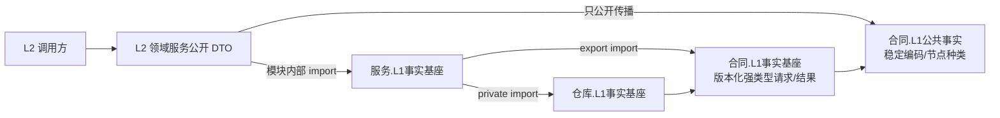
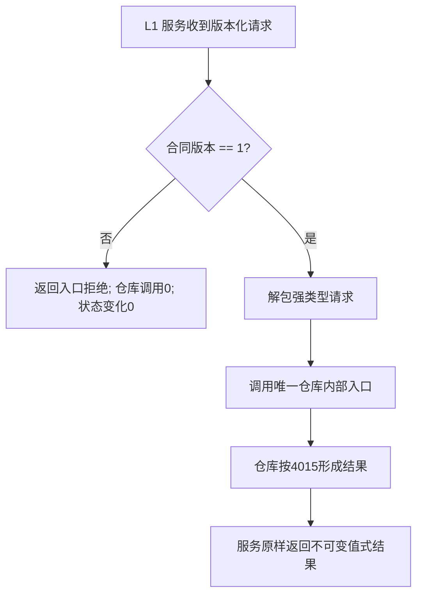

# L1-SIMPLIFY-CONTRACT-F0 版本化服务与仓库隔离函数流程图 v0.1

依据：[公共合同与仓库隔离详细设计](../规范/详细设计/20260804_L1-SIMPLIFY-CONTRACT-F0_公共合同与仓库隔离详细设计_v0.1.md)。

```mermaid
flowchart LR
    L2["L2 调用方"] --> D["L2 领域服务公开 DTO"]
    D -->|"只公开传播"| PF["合同.L1公共事实\n稳定编码/节点种类"]
    D -->|"模块内部 import"| S["服务.L1事实基座"]
    S -->|"export import"| FC["合同.L1事实基座\n版本化强类型请求/结果"]
    S -->|"private import"| R["仓库.L1事实基座"]
    R --> FC
    FC --> PF
```

```mermaid
flowchart TD
    A["L1 服务收到版本化请求"] --> B{"合同版本 == 1?"}
    B -- "否" --> C["返回入口拒绝; 仓库调用0; 状态变化0"]
    B -- "是" --> D["解包强类型请求"]
    D --> E["调用唯一仓库内部入口"]
    E --> F["仓库按4015形成结果"]
    F --> G["服务原样返回不可变值式结果"]
```

禁止边：L2 调用方或领域服务公开面直接 import 仓库；L2 DTO 引用写集键、写集请求、恢复材料或仓库类型。
