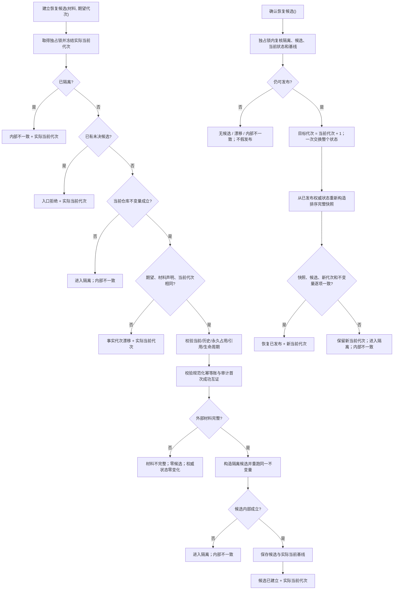

# L1-SIMPLIFY-P0-CLOSE 恢复候选互证与发布后读回函数流程图 v0.1

详细语义以 `规范/4015_子规范_L1简化事实基座.md` 和 P0-CLOSE v0.1 详细设计为准。

```mermaid
flowchart TD
    A["建立恢复候选(材料, 期望代次)"] --> B["取得独占锁并冻结实际当前代次"]
    B --> C{"已隔离?"}
    C -- 是 --> CI["内部不一致 + 实际当前代次"]
    C -- 否 --> D{"已有未决候选?"}
    D -- 是 --> DI["入口拒绝 + 实际当前代次"]
    D -- 否 --> E{"当前仓库不变量成立?"}
    E -- 否 --> EI["进入隔离；内部不一致"]
    E -- 是 --> F{"期望、材料声明、当前代次相同?"}
    F -- 否 --> FI["事实代次漂移 + 实际当前代次"]
    F -- 是 --> G["校验当前/历史/永久占用/引用/生命周期"]
    G --> H["校验规范化幂等账与审计首次成功互证"]
    H --> I{"外部材料完整?"}
    I -- 否 --> II["材料不完整；零候选；权威状态零变化"]
    I -- 是 --> J["构造隔离候选并重跑同一不变量"]
    J --> K{"候选内部成立?"}
    K -- 否 --> KI["进入隔离；内部不一致"]
    K -- 是 --> L["保存候选与实际当前基线"]
    L --> LR["候选已建立 + 实际当前代次"]

    M["确认恢复候选()"] --> N["独占锁内复核隔离、候选、当前状态和基线"]
    N --> O{"仍可发布?"}
    O -- 否 --> OI["无候选 / 漂移 / 内部不一致；不假发布"]
    O -- 是 --> P["目标代次 = 当前代次 + 1；一次交换整个状态"]
    P --> Q["从已发布权威状态重新构造排序完整快照"]
    Q --> R{"快照、候选、新代次和不变量逐项一致?"}
    R -- 是 --> S["恢复已发布 + 新当前代次"]
    R -- 否 --> T["保留新当前代次；进入隔离；内部不一致"]
```

固定边界：调用动作的返回只作为动作消息；恢复成功与事实代次必须以交换后重新读取到的权威状态校准，不能采用候选预计代次或动作自身预估状态。
