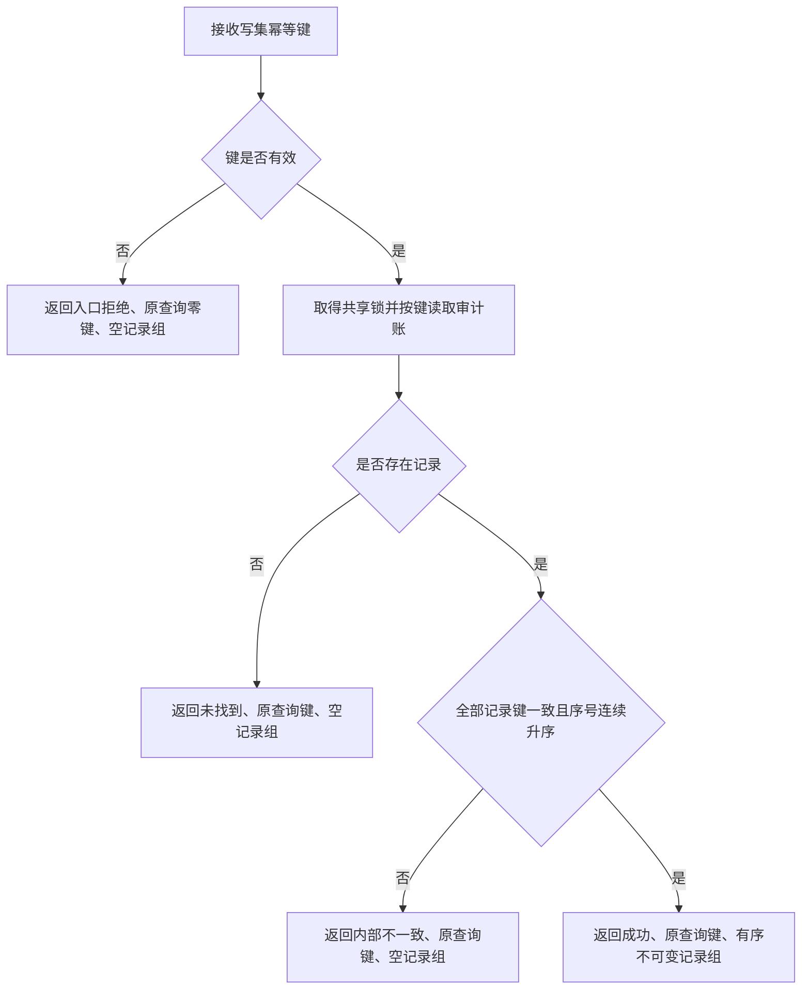
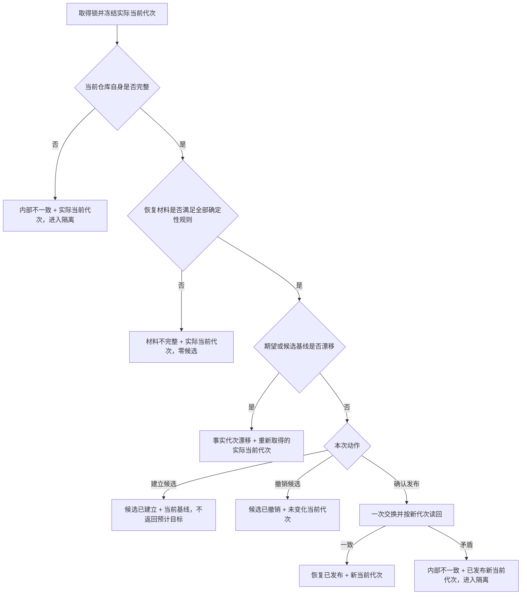

# L1-SIMPLIFY-P0-FIX 审计读取与恢复结果函数流程图 v0.2

本图替换 v0.1 中受具名漂移影响的审计读取与恢复结果节点；提交写集主流程保持 v0.1 不变。

## 读取审计

```mermaid
flowchart TD
    A["接收写集幂等键"] --> B{"键是否有效"}
    B -->|否| C["返回入口拒绝、原查询零键、空记录组"]
    B -->|是| D["取得共享锁并按键读取审计账"]
    D --> E{"是否存在记录"}
    E -->|否| F["返回未找到、原查询键、空记录组"]
    E -->|是| G{"全部记录键一致且序号连续升序"}
    G -->|否| H["返回内部不一致、原查询键、空记录组"]
    G -->|是| I["返回成功、原查询键、有序不可变记录组"]
```

## 恢复结果代次与错误分类

```mermaid
flowchart TD
    A["取得锁并冻结实际当前代次"] --> B{"当前仓库自身是否完整"}
    B -->|否| C["内部不一致 + 实际当前代次，进入隔离"]
    B -->|是| D{"恢复材料是否满足全部确定性规则"}
    D -->|否| E["材料不完整 + 实际当前代次，零候选"]
    D -->|是| F{"期望或候选基线是否漂移"}
    F -->|是| G["事实代次漂移 + 重新取得的实际当前代次"]
    F -->|否| H{"本次动作"}
    H -->|建立候选| I["候选已建立 + 当前基线，不返回预计目标"]
    H -->|撤销候选| J["候选已撤销 + 未变化当前代次"]
    H -->|确认发布| K["一次交换并按新代次读回"]
    K -->|一致| L["恢复已发布 + 新当前代次"]
    K -->|矛盾| M["内部不一致 + 已发布新当前代次，进入隔离"]
```

资源或锁前失败无法安全读取代次时返回0；已经冻结结果基线后失败则返回该基线。任何未发布分支都不得返回预计 `当前代次+1`。
