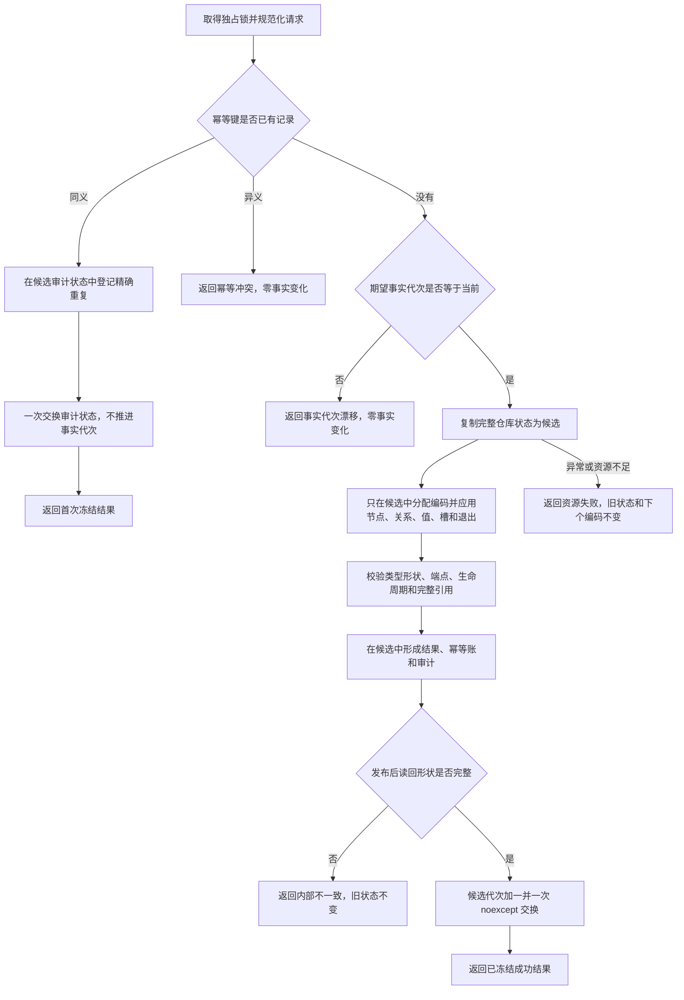
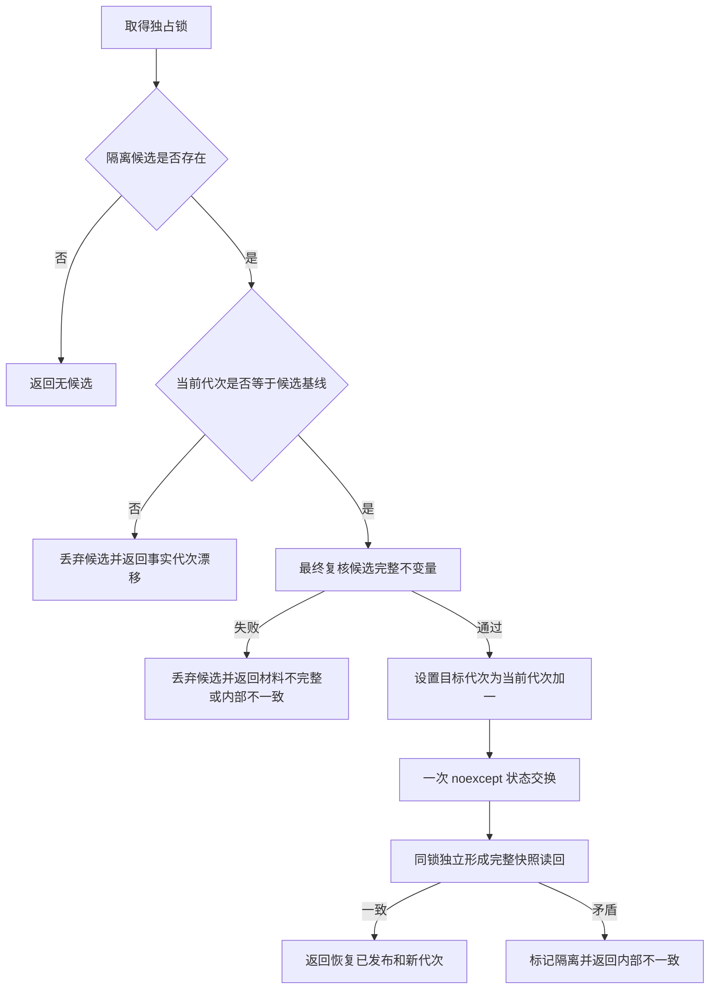

# L1-SIMPLIFY-P0-FIX 提交与恢复原子发布函数流程图 v0.1

依据：`规范/4015_子规范_L1简化事实基座.md`、`规范/详细设计/20260804_L1-SIMPLIFY-P0-FIX_合同补齐详细设计_v0.1.md`。

## 提交写集

根函数：`L1写入结果 L1事实基座仓库::提交(const L1写集请求& 请求)`

物理位置：`海中鱼巣/核心/仓库.L1事实基座.ixx`

## 确认恢复候选

根函数：`L1恢复结果 L1事实基座仓库::确认恢复候选()`

物理位置：`海中鱼巣/核心/仓库.L1事实基座.ixx`

恢复建立只负责在隔离对象中构造和验证候选；撤销只丢候选。二者都不改变当前事实代次，也不伪造零幂等键审计。
