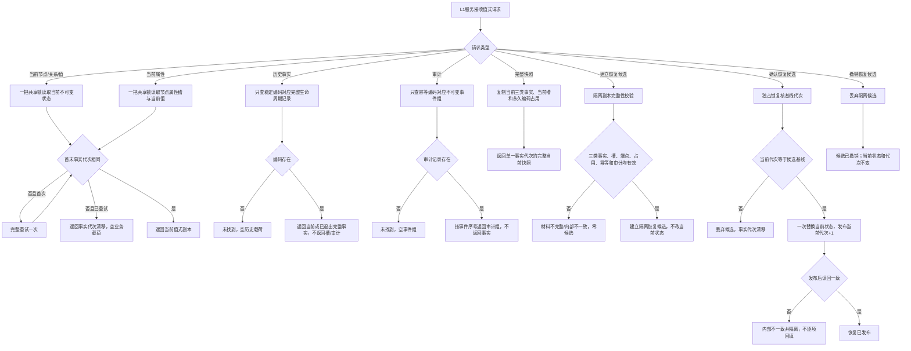
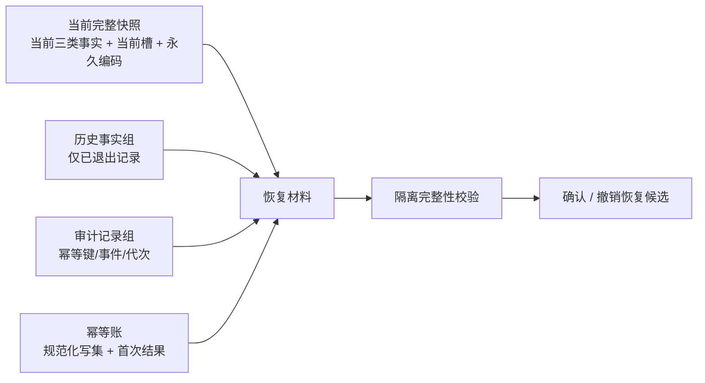

# L1-SIMPLIFY-P0 三类事实读取与恢复业务流程图 v0.2

绑定计划：`L1-SIMPLIFY-P0 v0.2`

绑定规范：`4015 v0.2`、`4040`、`4070`

本图冻结当前、历史、审计、完整快照和恢复候选五条显式路径；任何路径不得把另一条路径的材料塞入结果。

## 材料边界

禁止边：当前读取不得返回历史或审计；历史读取不得返回当前槽；审计不得裁决事实成功；快照不得隐藏历史 / 审计；恢复不得从索引、SQL 或材料旁路补造事实。

## 事务与完成边界

- 普通写集遵循候选、确认、逆序撤销、最后一次代次发布和发布后读回。
- 读取只复制值式材料，不把锁、仓指针、候选令牌传给调用方。
- P0 完成只证明独立 L1 DTO、服务入口、隔离恢复候选和专项矩阵进入工程；不证明任何领域迁移或旧基座删除。
