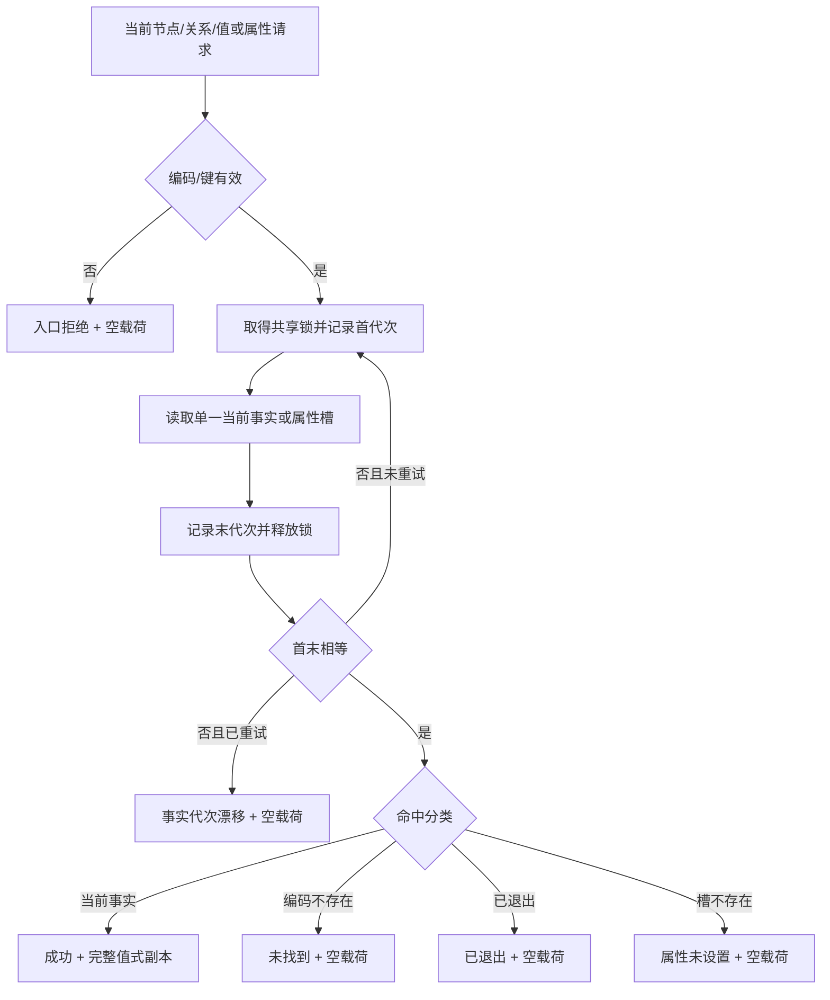
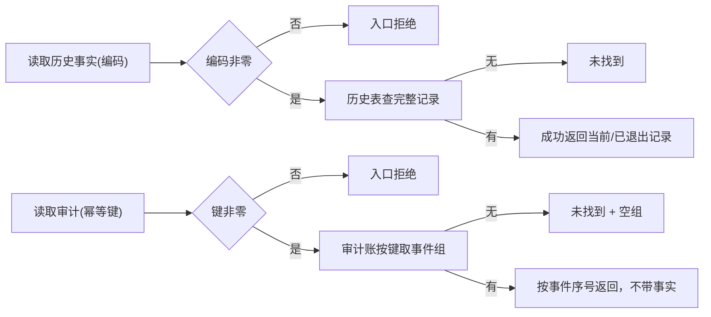
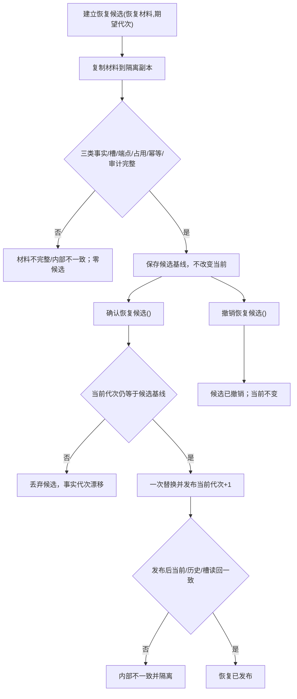

# L1-SIMPLIFY-P0 服务读取历史审计与恢复候选函数流程图 v0.1

绑定详细设计：`20260804_L1简化事实基座P0详细设计_v0.2.md`

## 函数位置与签名

唯一函数所有者为 `海中鱼巣/核心/服务.L1事实基座.ixx` 的 `L1事实基座服务`。只返回数据头中定义的值式 DTO；不返回仓库、锁、候选令牌或领域对象。

```cpp
L1读取结果 读取当前节点(稳定编码 编码) const;
L1读取结果 读取当前关系(稳定编码 编码) const;
L1读取结果 读取当前值(稳定编码 编码) const;
L1属性读取结果 读取当前属性(稳定编码 节点, 稳定编码 属性类型) const;
L1历史读取结果 读取历史事实(稳定编码 编码) const;
L1审计读取结果 读取审计(写集幂等键 幂等键) const;
L1完整快照结果 读取完整快照() const;
L1恢复结果 建立恢复候选(const L1恢复材料&, std::uint64_t 期望事实代次);
L1恢复结果 确认恢复候选();
L1恢复结果 撤销恢复候选() noexcept;
```

## 当前读取节点图



逐节点合同：入口拒绝不读仓；锁内只复制；非成功 optional 为空；当前结果带读取代次；属性结果只带节点、属性类型和当前值编码。

## 历史与审计图



历史和审计的结果类型不同，二者不得由一个 `L1读取结果` 重载或 variant 混合承载。

## 恢复候选图



`确认恢复候选` 是唯一恢复发布入口；`撤销恢复候选` 是显式拒绝发布入口。建立失败、确认漂移、撤销和发布后矛盾均不返回业务事实副本。

## 诊断责任

服务函数将结构化状态向上送出；自检函数只断言状态、字段和当前事实不变，不在服务内记录日志。`bad_alloc` / `length_error` 映射资源失败，其它异常映射内部不一致。
