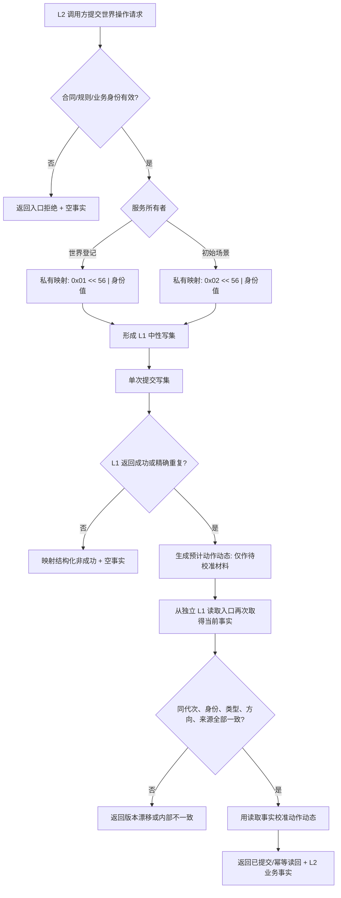

# L1-SIMPLIFY-P1-WORLD-STRUCTURE L2 幂等身份映射函数流程图 v0.4

依据：[L2 业务合同隔离详细设计](../规范/详细设计/20260804_L1-SIMPLIFY-P1-WORLD-STRUCTURE_L2业务合同隔离详细设计_v0.4.md)。

约束：业务身份是 L2 合同；映射键、写集和预计动作动态均不得进入 L2 公开结果。成功事实只来自独立读取校准。
