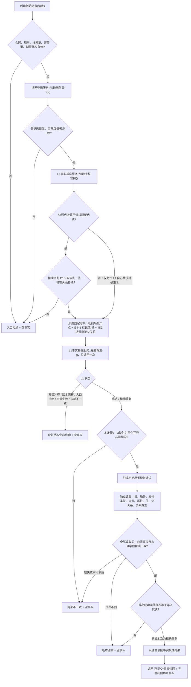

# L1-SIMPLIFY-P1-WORLD-STRUCTURE 创建初始场景函数流程图 v0.1

依据：`规范/详细设计/20260804_L1-SIMPLIFY-P1-WORLD-STRUCTURE_初始场景写读闭环详细设计_v0.3.md`。

```mermaid
flowchart TD
    A["创建初始场景(请求)"] --> B{"合同、规则、根见证、幂等键、期望代次有效?"}
    B -- "否" --> R1["入口拒绝 + 空事实"]
    B -- "是" --> C["世界登记服务::读取当前登记()"]
    C --> D{"登记已读取、完整且根/规则一致?"}
    D -- "否" --> R1
    D -- "是" --> E["L1事实基座服务::读取完整快照()"]
    E --> F{"快照代次等于请求期望代次?"}
    F -- "是" --> G{"精确匹配 P1B 五节点一值一槽零关系基线?"}
    G -- "否" --> R1
    G -- "是" --> H["形成固定写集：初始场景节点 + I64=1 标记值/槽 + 根到场景直接父关系"]
    F -- "否：仅允许 L1 自己裁决精确重复" --> H
    H --> I["L1事实基座服务::提交写集()，只调用一次"]
    I --> J{"L1 状态"}
    J -- "幂等冲突 / 版本漂移 / 入口拒绝 / 资源失败 / 内部不一致" --> R2["映射结构化非成功 + 空事实"]
    J -- "成功 / 精确重复" --> K{"本地键1—3映射为三个互异非零编码?"}
    K -- "否" --> R3["内部不一致 + 空事实"]
    K -- "是" --> L["形成初始场景读取请求"]
    L --> M["独立读取：根、场景、属性类型、来源、属性、值、父关系、关系类型"]
    M --> N{"全部读取同一非零事实代次且字段精确一致?"}
    N -- "代次不同" --> R4["版本漂移 + 空事实"]
    N -- "缺失或字段矛盾" --> R3
    N -- "是" --> O{"首次成功读回代次等于写入代次?"}
    O -- "否" --> R4
    O -- "是或本次为精确重复" --> P["以独立读回事实校准结果"]
    P --> Q["返回 已提交/幂等读回 + 完整初始场景事实"]
```

边界：本图只描述隔离新 L1 的首个子场景写读闭环；不描述运行期、恢复、存在、状态动态、动作消息、旧入口或生产接线。
