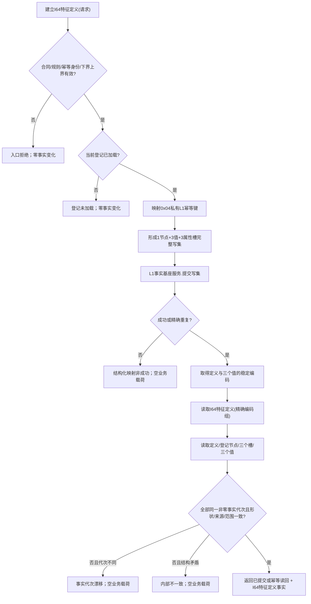

# L1-SIMPLIFY-P2-FEATURE-DEFINITION 抽象特征定义登记函数流程图 v0.1

```mermaid
flowchart TD
    A["建立I64特征定义(请求)"] --> B{"合同/规则/幂等身份/下界上界有效?"}
    B -- 否 --> R1["入口拒绝；零事实变化"]
    B -- 是 --> C{"当前登记已加载?"}
    C -- 否 --> R2["登记未加载；零事实变化"]
    C -- 是 --> D["映射0x04私有L1幂等键"]
    D --> E["形成1节点+3值+3属性槽完整写集"]
    E --> F["L1事实基座服务.提交写集"]
    F --> G{"成功或精确重复?"}
    G -- 否 --> R3["结构化映射非成功；空业务载荷"]
    G -- 是 --> H["取得定义与三个值的稳定编码"]
    H --> I["读取I64特征定义(精确编码组)"]
    I --> J["读取定义/登记节点/三个槽/三个值"]
    J --> K{"全部同一非零事实代次且形状/来源/范围一致?"}
    K -- 否且代次不同 --> R4["事实代次漂移；空业务载荷"]
    K -- 否且结构矛盾 --> R5["内部不一致；空业务载荷"]
    K -- 是 --> S["返回已提交或幂等读回 + I64特征定义事实"]
```

边界：流程只建立抽象定义节点及三项直接属性，不建立实例槽、关系22或当前特征值。每次动作结果以独立 L1 读取事实校准，不采用提交函数自身的预计状态作为最终业务事实。
