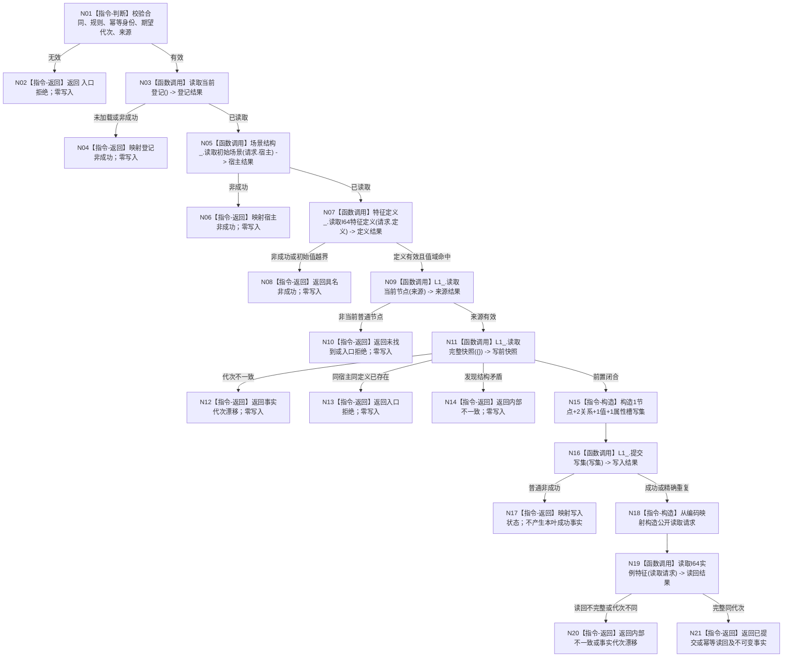

# 建立初始场景 I64 实例特征函数流程图 v0.1

更新时间：2026-08-04

## 依据

```text
规范/0050_项目通用机器逻辑与禁止性规则总纲_20260721.md
规范/4015_子规范_L1简化事实基座.md
规范/1130_根规范_特征节点_20260720.md
规范/2100_根规范_特征值_20260720.md
规范/4110_子规范_特征节点实现与字段边界_20260720.md
规范/详细设计/20260804_L1-SIMPLIFY-P3-FEATURE-INSTANCE_初始场景实例特征槽与初始值详细设计_v0.1.md
```

## 身份与边界

正式目标单函数图；仅冻结本叶待新增函数，不描述当前已实现能力。

## 函数合同

```text
根函数：建立初始场景I64实例特征
归属模块 / 文件 / 层级：海中鱼巣.领域.服务.L1实例特征 / 海中鱼巣/领域/服务.L1实例特征.ixx / L2领域服务
现有或待新增：待新增
完整签名：I64实例特征结果 L1实例特征服务::建立初始场景I64实例特征(const 初始场景I64实例特征建立请求& 请求)
参数：请求 / const引用输入 / 调用期有效 / 非法合同、身份、代次或来源拒绝
返回结果：调用方拥有的值式结果；成功、幂等、逻辑内非成功、资源失败或内部不一致
被调函数流程图：无；三个被调公开服务按其既有合同消费
```

## 流程图



## 节点合同

| 节点 | 类型 | 输入 | 输出 | 事实读写 | 验证 |
| --- | --- | --- | --- | --- | --- |
| N05 | 函数调用 | `请求.宿主` | 当前初始场景事实 | 只读场景领域事实 | 宿主身份和代次 |
| N07 | 函数调用 | `请求.定义` | 当前 I64 定义事实 | 只读特征定义事实 | 值域闭区间 |
| N11 | 函数调用 | 空快照请求 | 当前完整 L1 快照 | 只读 | 唯一宿主+定义、同代次 |
| N15 | 本函数内指令 | 已验证材料 | 中性 L1 写集 | 仅构造候选 | 精确形状门禁 |
| N16 | 函数调用 | 中性写集 | 写入结果和编码映射 | 单一原子发布 | 期望代次、幂等 |
| N19 | 函数调用 | 公开读取请求 | 不可变实例事实 | 独立读回 | 端点、角色、属性、值、来源、代次 |

## 关键边界

```text
当前值使用属性槽和值事实，不创建角色3关系。
不使用固定关系22编号、完整句柄、索引或旧特征服务。
槽和初始值必须同一写集发布；函数返回不能替代独立读回事实。
```
