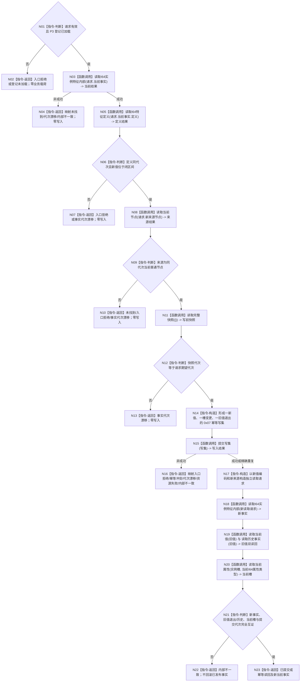

# L1-SIMPLIFY-P4-FEATURE-VALUE 换代 I64 实例特征当前值函数流程图 v0.1

更新时间：2026-08-04

## 依据

```text
规范/4015_子规范_L1简化事实基座.md
规范/详细设计/20260804_L1-SIMPLIFY-P4-FEATURE-VALUE_实例特征当前I64值换代详细设计_v0.1.md
正式代码基线 fa3cb1401e8c1cc2cf71ff704590404fbcc22889
```

## 身份与边界

本图是目标单函数施工流程图，只冻结待新增函数合同，不描述当前代码已经实现该能力。

## 函数合同

```text
根函数：L1实例特征服务::换代I64实例特征当前值
归属模块 / 文件 / 层级：海中鱼巣.领域.服务.L1实例特征 / 海中鱼巣/领域/服务.L1实例特征.ixx / L2领域服务
现有或待新增：待新增公开成员函数
完整签名：I64实例特征结果 L1实例特征服务::换代I64实例特征当前值(const I64实例特征当前值换代请求& 请求)
参数：请求；const 左值引用；调用期只读；不得为非法版本、零幂等身份、零期望代次或缺失稳定编码
返回结果：I64实例特征结果；成功/幂等带新当前事实和原两关系，非成功零业务载荷
被调函数流程图：现有 P3 读取路径作为直接依据；L1 提交和读取按正式核心合同复用，不在本图展开
```

## 流程图



## 节点合同

| 节点组 | 类型 | 输入 | 输出 | 事实读写 | 验证 |
| --- | --- | --- | --- | --- | --- |
| N01—N13 | 判断 / 函数调用 / 返回 | 请求及当前公开事实 | 具名前置结果 | 只读；失败零写入 | 非法、未找到、越界、漂移矩阵 |
| N14—N16 | 构造 / 函数调用 / 返回 | 已互证当前事实 | L1写入结果 | 单写集最后发布 | 写集精确三项、幂等和竞争 |
| N17—N23 | 构造 / 函数调用 / 判断 / 返回 | 提交结果与新编码 | 校准后的新当前事实 | 只读新当前、旧历史和槽 | 同代次、旧退出、新槽、零预估替代 |

## 关键边界

```text
新函数不新增节点或关系，不修改实例槽和定义，不保存第二份当前值。
动作自身的提交返回只作预计结果；最终返回前必须以新事实、旧历史和当前槽的再次读取校准。
合法非成功不写逻辑错误日志；资源失败和内部不一致结构化向上送出。
```
