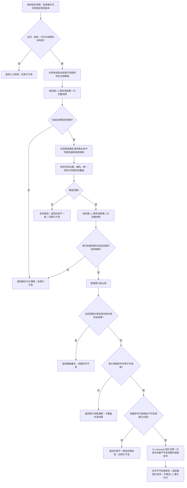

# L1-SIMPLIFY-P5-INDEX 从指定快照确定重建函数流程图 v0.1

图类型：目标单函数流程图

方案步骤：`SELF-GOV-CLOSURE v0.2 / STEP-1A`

唯一目标根函数：

```cpp
L1索引维护结果 L1事实可重建索引::从指定快照确定重建(
    const L1索引重建请求& 请求);
```

目标物理位置：

```text
文件：海中鱼巣/核心/索引.L1事实基座.ixx
模块：海中鱼巣.核心.索引.L1事实基座
```



## 固定边界

- 候选构造、排序、验证和两次权威快照读取均不持有索引锁。
- 索引锁内不调用 L1 服务，不记录日志，不执行 I/O、回调或等待。
- 局部候选在完整验证前不可见；失败只丢弃候选，不改变旧视图。
- 全部可失败校验、分配和序号溢出检查都在交换前完成；交换后不得设置可返回失败的运行分支。
- 本函数不返回索引候选，不写 L1、SQL、材料、历史或审计。
- 查询命中后的权威回读由同模块 `查询并回读当前事实` 承担；原始候选编码不进入 L2 业务接口。
