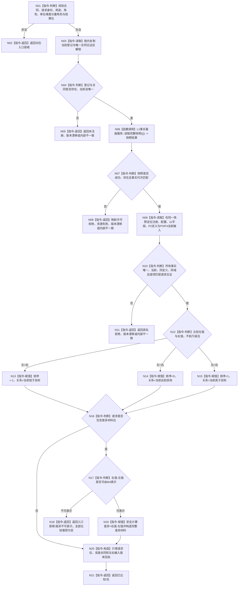

# L1-SIMPLIFY-P6-I64-COMPARE 比较特征函数流程图 v0.1

更新时间：2026-08-04

## 依据

```text
规范/4130_子规范_特征值三态比较底层逻辑_20260720.md
规范/4180_子规范_特征值域差异算子与比较算法注册.md
规范/4015_子规范_L1简化事实基座.md
规范/详细设计/20260804_L1-SIMPLIFY-P6-I64-COMPARE_I64目标判断注册比较详细设计_v0.1.md
```

## 身份与边界

本图是待新增生产函数的正式目标单函数流程图，只冻结 `特征比较服务::比较特征`。登记函数的写集与读回合同由详细设计 §6 冻结，不压入本图。

## 函数合同

```text
根函数：特征比较服务::比较特征
归属模块 / 文件 / 层级：海中鱼巣.领域.服务.特征比较 / 海中鱼巣/领域/服务.特征比较.ixx / L1 领域服务
现有或待新增：待新增
完整签名：特征比较结果 特征比较服务::比较特征(const 特征比较请求& 请求) const
参数：请求；const 引用借用，只在调用期间有效，不保留
返回结果：特征比较结果；值式返回，已比较或结构化非成功
被调函数流程图：L1事实基座服务::读取完整快照 为现行简单服务转发，本包不重复建图
```

## 流程图



## 节点合同

| 节点 | 类型 | 参数 / 输入绑定 | 结果 / 输出绑定 | 事实读写 | 后继条件 | 验证 |
| --- | --- | --- | --- | --- | --- | --- |
| N01—N05 | 本函数内指令 | 请求、内存登记见证 | 结构化前置结果或值式见证副本 | 不读写机器事实 | 前置成立 | 请求和注册分支矩阵 |
| N06 | 函数调用 | `{L1事实基座合同版本}` | `L1完整快照结果 -> 快照结果` | 一次权威只读 | 调用完成 | 生产源码调用次数精确1 |
| N07—N11 | 本函数内指令 | 快照、合同、请求见证 | 校准后的左右 I64 或非成功 | 只读同一快照 | 材料完整且同代次 | 缺失、漂移、损坏矩阵 |
| N12—N15 | 本函数内指令 | 左值、右值 | 排序三态、具名关系 | 零事实写入 | 三分支唯一 | 小于/等于/大于 |
| N16—N19 | 本函数内指令 | 结果位、左右值 | 空差异、拒绝或完整差异材料 | 零事实写入 | 可表示性成立 | I64 极值矩阵 |
| N20—N21 | 本函数内指令 | 已校准上下文和请求位 | 完整 `特征比较结果` | 零事实写入 | 全部不变量成立 | 1/2/4/7 载荷矩阵 |

## 关键边界

```text
唯一权威读取是一次 L1完整快照；禁止多次无约束读取拼接混代材料。
排序不执行减法；只有请求差异位时才检查并计算右减左。
比较不写 L1、注册、状态、动态、日志或索引。
旧特征服务、旧句柄、SQL、材料和 P5 索引均不是本函数后备路径。
```
