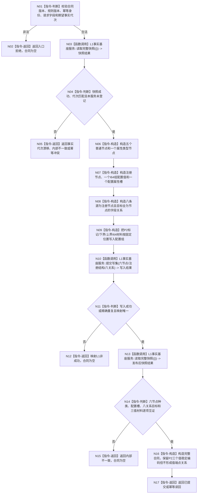

# L1-SIMPLIFY-P6-I64-COMPARE 合同登记结构修订函数流程图 v0.2

更新时间：2026-08-04

## 依据

```text
规范/4015_子规范_L1简化事实基座.md
规范/4020_子规范_领域类型化数据记录与组合读取投影边界.md
规范/详细设计/20260804_L1-SIMPLIFY-P6-I64-COMPARE_I64目标判断注册比较详细设计_v0.2.md
规范/详细设计/20260804_L1-SIMPLIFY-P6-I64-COMPARE_I64目标判断注册比较详细设计_v0.1.md（未被 v0.2 替换部分）
```

## 身份与边界

本图是执行施工图，唯一根函数为合同登记函数；v0.1 的 `比较特征` 图继续负责比较算法。本图只冻结 P6 漂移涉及的 L1 节点种类、值承载和关系端点，不增加公开函数。

## 函数合同

```text
根函数：特征比较服务::登记I64目标判断比较合同
归属模块 / 文件 / 层级：海中鱼巣.领域.服务.特征比较 / 海中鱼巣/领域/服务.特征比较.ixx / L1 领域服务
现有或待新增：待新增
完整签名：I64目标判断比较合同结果 特征比较服务::登记I64目标判断比较合同(const I64目标判断比较合同登记请求& 请求)
参数：请求；const 引用借用，仅调用期间有效，不保留
返回结果：I64目标判断比较合同结果；成功为已提交/幂等读回并携带完整合同，非成功合同为空
被调函数流程图：L1事实基座服务::读取完整快照；沿用现有简单只读转发图
```

## 流程图



## 节点合同

| 节点 | 类型 | 参数 / 输入绑定 | 结果 / 输出绑定 | 事实读写 | 后继条件 | 验证 |
| --- | --- | --- | --- | --- | --- | --- |
| N01—N02 | 本函数内指令 | 请求 | 结构化入口拒绝 | 零写入 | 合同有效 | 非零身份/版本矩阵 |
| N03 | 函数调用 | `{}` | `L1完整快照结果` | 只读一次 | 取得基线 | 调用次数1 |
| N04—N05 | 本函数内指令 | 快照、内存登记 | 非成功结果 | 零写入 | 代次相等且未登记 | 非空 L1/代次漂移 |
| N06 | 本函数内指令 | 登记身份 | 五普通一属性类型节点候选 | 写集内存构造 | 构造完成 | 节点种类6/6 |
| N07 | 本函数内指令 | 注册身份、三类配置材料 | 一值一槽 | 写集内存构造 | 构造完成 | 属性类型与所属校验 |
| N08 | 本函数内指令 | 八个节点目标 | 八条关系 | 写集内存构造 | 每个目标为节点 | 值端点0命中 |
| N09 | 本函数内指令 | P2 三值材料 | 有序 I64 组 | 写集内存构造 | 三材料互证可用 | 位置/材料矩阵 |
| N10 | 函数调用 | 完整 L1 写集 | `L1写入结果` | 一次原子写 | 成功或精确重复 | 写入口次数1 |
| N11—N15 | 本函数内指令/函数调用 | 发布映射和快照 | 合同或结构化失败 | 只读发布后校准 | 逐项成立 | 发布后读回矩阵 |
| N16—N17 | 本函数内指令 | 已校准事实 | 完整合同 | 零后续写 | 返回 | 合同字段闭合 |

## 关键边界

```text
关系目标只能是节点；P2 三个值事实只以稳定编码和配置 I64 组材料互证。
合同配置 I64 组属性类型必须是属性类型节点，不能作为普通节点提交。
禁止代理节点、复制值事实、裸 I64 字段替代 P2 值事实或把值编码放入关系端点。
```

## 验证

本图只声明 v0.2 设计合同；执行前必须按计划完成 UTF-8、Mermaid、节点合同和正式文档检查。不得据此声明代码编译或运行通过。
