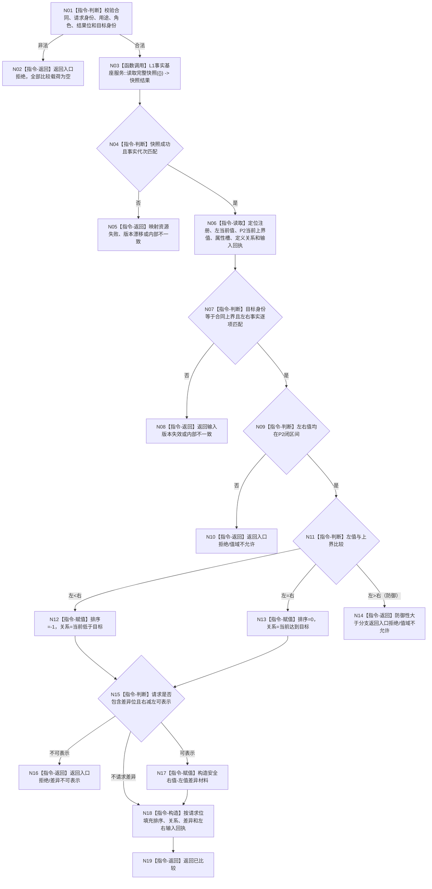

# L1-SIMPLIFY-P6-I64-COMPARE 比较特征函数流程图 v0.3

更新时间：2026-08-05

## 依据

```text
规范/4130_子规范_特征值三态比较底层逻辑_20260720.md
规范/4180_子规范_特征值域差异算子与比较算法注册.md
规范/详细设计/20260804_L1-SIMPLIFY-P6-I64-COMPARE_I64目标判断注册比较详细设计_v0.3.md
规范/详细设计/20260804_L1-SIMPLIFY-P6-I64-COMPARE_I64目标判断注册比较详细设计_v0.2.md（L1结构未变部分）
```

## 身份与边界

本图是执行施工图，唯一根函数为 `特征比较服务::比较特征`。P6 v0.2 合同登记结构图继续有效；本图只冻结当前目标策略的可达/不可达比较分支。目标固定为 P2 当前上界，不新增目标值提供者。

## 函数合同

```text
根函数：特征比较服务::比较特征
归属模块 / 文件 / 层级：海中鱼巣.领域.服务.特征比较 / 海中鱼巣/领域/服务.特征比较.ixx / L1 领域服务
现有或待新增：待新增
完整签名：特征比较结果 特征比较服务::比较特征(const 特征比较请求& 请求) const
参数：请求；const 引用借用，仅调用期间有效，不保留
返回结果：特征比较结果；已比较或结构化非成功，非成功排序/关系/差异均为空
被调函数流程图：L1事实基座服务::读取完整快照；只读调用一次
```

## 流程图



## 节点合同

| 节点 | 类型 | 参数 / 输入绑定 | 结果 / 输出绑定 | 事实读写 | 后继条件 | 验证 |
| --- | --- | --- | --- | --- | --- | --- |
| N01—N02 | 本函数内指令 | 请求 | 入口拒绝 | 零写入 | 合同有效 | 入口矩阵 |
| N03 | 函数调用 | `{}` | `L1完整快照结果` | 权威只读一次 | 快照返回 | 调用次数1 |
| N04—N08 | 本函数内指令 | 快照、合同、左右输入 | 非成功结果 | 只读 | 目标为合同上界且见证一致 | 身份/代次/来源矩阵 |
| N09—N10 | 本函数内指令 | 左值、上界和值域 | 值域拒绝 | 零写入 | 两值在闭区间 | 越界零载荷 |
| N11—N14 | 本函数内指令 | 左值、上界 | -1/0 成功；> 防御拒绝 | 零写入 | 分支固定 | 小于/等于/大于防御 |
| N15—N17 | 本函数内指令 | 结果位、左右值 | 差异或拒绝 | 零写入 | 可表示 | 极值矩阵 |
| N18—N19 | 本函数内指令 | 已校准结果 | 已比较 | 零写入 | 请求位合法 | 结果位矩阵 |

## 关键边界

```text
P2/P3/P4 合同保证当前值不大于上界，因此“左值大于目标”不是成功夹具。
N14 保留为防御性代码路径，只返回值域拒绝，不得伪造成功三态。
目标身份必须是合同上界；P6 不建立独立目标值登记或目标提供者。
```

## 验证

本图只冻结 v0.3 设计；执行前检查 Mermaid、完整签名、每节点类型、返回路径和单次快照调用约束。不得把文档存在升级为代码或运行通过。
