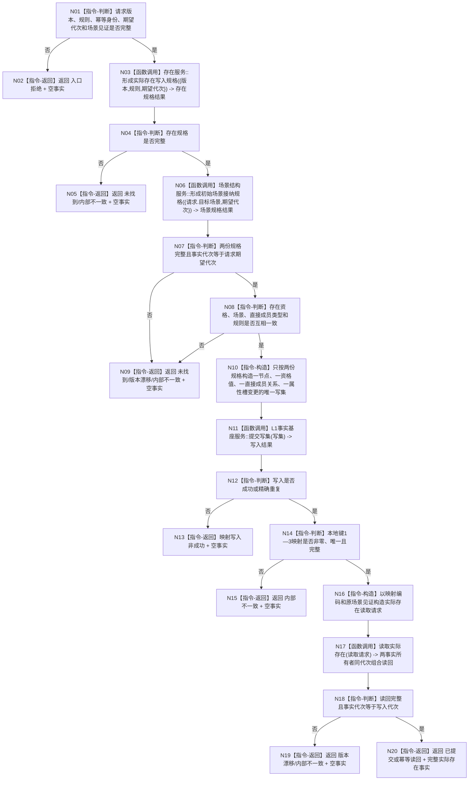

# L1-SIMPLIFY-P7-EXISTENCE 在初始场景创建实际存在函数流程图 v0.1

更新时间：2026-08-04

## 依据

```text
规范/1140_根规范_存在节点_20260720.md
规范/4190_子规范_语义分层世界结构与状态动态因果边界.md
规范/4200_子规范_世界树业务服务与同代次完整事实快照.md
规范/详细设计/20260804_L1-SIMPLIFY-P7-EXISTENCE_实际存在与初始场景归属详细设计_v0.1.md
```

## 身份与边界

本图是 STEP-3A 目标单函数施工图，只描述实际存在和初始场景归属的原子创建。它不描述登记内部过程、存在宿主特征、状态或动态。

## 函数合同

```text
根函数：在初始场景创建实际存在
归属模块 / 文件 / 层级：海中鱼巣.领域.组合.L1实际存在场景 / 海中鱼巣/领域/组合.L1实际存在场景.ixx / L2组合入口
现有或待新增：待新增
完整签名：实际存在结果 L1实际存在场景组合服务::在初始场景创建实际存在(const 实际存在创建请求& 请求)
参数：请求；只读借用；调用期间有效；版本、规则、幂等身份、期望代次或场景见证非法时入口拒绝
返回结果：调用方拥有的实际存在结果；仅已提交/幂等读回携带完整事实
被调函数流程图：无；现行世界登记、初始场景和 L1 公开函数按其正式合同调用
```

## 流程图



## 节点合同

| 节点 | 类型 | 参数 / 输入绑定 | 结果 / 输出绑定 | 事实读写 | 后继条件 | 验证 |
| --- | --- | --- | --- | --- | --- | --- |
| N03 | 函数调用 | 版本、规则、期望代次 | 存在写入规格 | 只读存在登记 | 调用完成 | 登记未加载矩阵 |
| N06 | 函数调用 | 目标场景、期望代次 | 场景接纳规格 | 只读世界登记/初始场景 | 调用完成 | 世界根/场景/代次矩阵 |
| N10 | 本函数内指令 | 两份规格和请求 | 确定性写集 | 尚未写入 | 写集完整 | 静态形状核对 |
| N11 | 函数调用 | 写集 -> 请求 | 写入结果 | 唯一原子写入 | 调用完成 | 幂等/冲突/零变化 |
| N17 | 函数调用 | 读取请求 -> 请求 | 独立读回 | 两事实所有者只读已发布事实 | 调用完成 | 同代次逐项读回 |

## 关键边界

```text
存在资格规格只能由存在服务形成；场景接纳规格只能由场景结构服务形成。
组合服务把关系固定为 初始场景 -> 实际存在，使用场景规格中的直接成员关系类型，顺序0。
资格固定为存在规格中的I64值1，来源固定为存在服务身份。
发布前失败零普通可读变化；发布后读回失败不得补写或回滚。
本函数不创建实例特征、状态、动态、因果、自我资格或治理虚拟存在。
```
