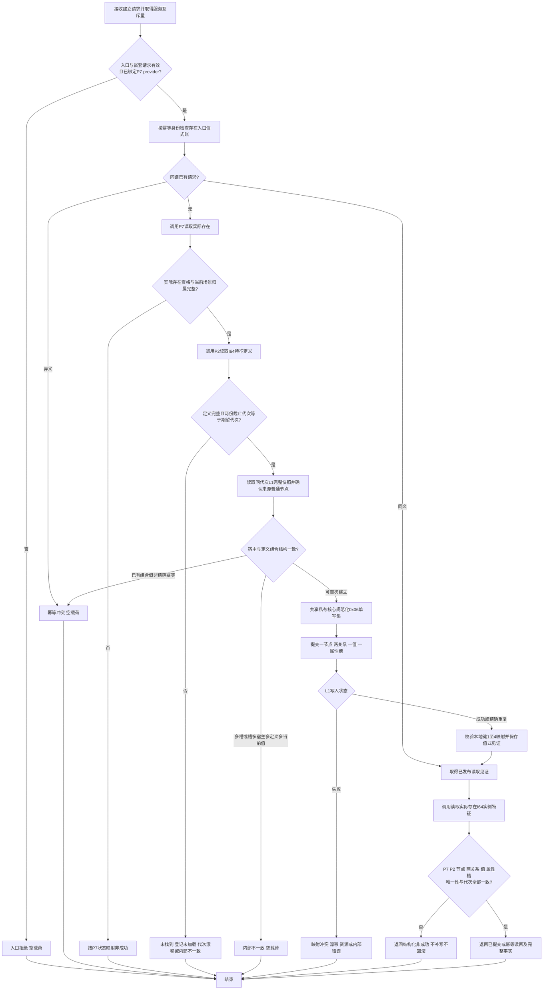

# 建立实际存在 I64 实例特征函数流程图 v0.1

对应函数：

```cpp
I64实例特征结果 L1实例特征服务::建立实际存在I64实例特征(
    const 实际存在I64实例特征建立请求& 请求);
```


```mermaid
flowchart TD
    A[接收建立请求并取得服务互斥量] --> B{入口与嵌套请求有效\n且已绑定P7 provider?}
    B -- 否 --> X1[入口拒绝 空载荷]
    B -- 是 --> C[按幂等身份检查存在入口值式账]
    C --> D{同键已有请求?}
    D -- 异义 --> X2[幂等冲突 空载荷]
    D -- 同义 --> R0[取得已发布读取见证]
    D -- 无 --> E[调用P7读取实际存在]
    E --> F{实际存在资格与当前场景归属完整?}
    F -- 否 --> X3[按P7状态映射非成功]
    F -- 是 --> G[调用P2读取I64特征定义]
    G --> H{定义完整且两份截止代次等于期望代次?}
    H -- 否 --> X4[未找到 登记未加载 代次漂移或内部不一致]
    H -- 是 --> I[读取同代次L1完整快照并确认来源普通节点]
    I --> J{宿主与定义组合结构一致?}
    J -- 多槽或槽多宿主多定义多当前值 --> X5[内部不一致 空载荷]
    J -- 已有组合但非精确幂等 --> X2
    J -- 可首次建立 --> K[共享私有核心规范化0x06单写集]
    K --> L[提交一节点 两关系 一值 一属性槽]
    L --> M{L1写入状态}
    M -- 失败 --> X6[映射冲突 漂移 资源或内部错误]
    M -- 成功或精确重复 --> N[校验本地键1至4映射并保存值式见证]
    N --> R0
    R0 --> R1[调用读取实际存在I64实例特征]
    R1 --> R2{P7 P2 节点 两关系 值 属性槽\n唯一性与代次全部一致?}
    R2 -- 否 --> X7[返回结构化非成功 不补写不回滚]
    R2 -- 是 --> Z[返回已提交或幂等读回及完整事实]

    X1 --> Q[结束]
    X2 --> Q
    X3 --> Q
    X4 --> Q
    X5 --> Q
    X6 --> Q
    X7 --> Q
    Z --> Q
```

边界：P7 的初始场景归属关系只证明实际存在资格，不得作为实例槽宿主关系；本函数不创建状态、动态、因果或结算，也不实现存在宿主当前值换代。
