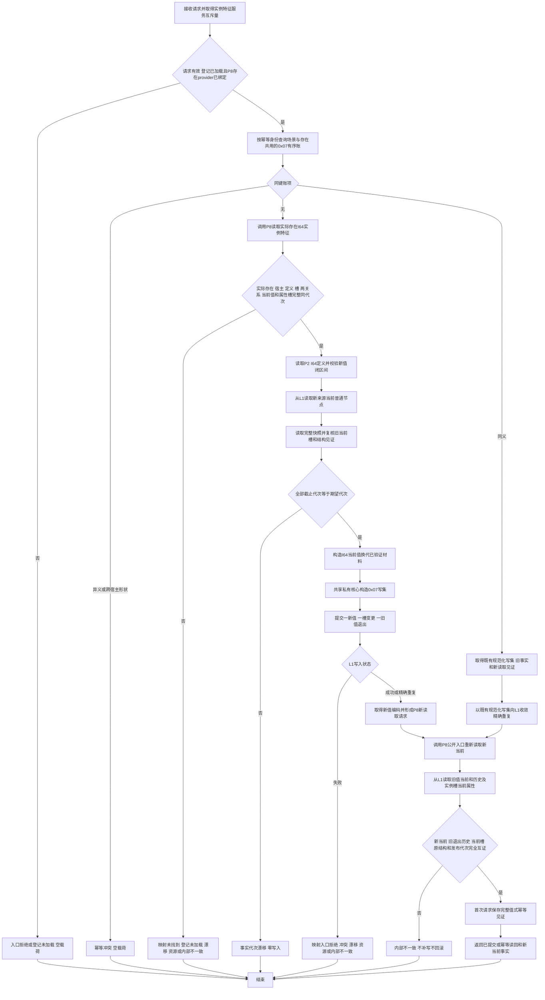

# L1-SIMPLIFY-P10-EXISTENCE-FEATURE-VALUE 换代实际存在 I64 实例特征当前值函数流程图 v0.1

更新时间：2026-08-05

## 函数合同

```text
根函数：L1实例特征服务::换代实际存在I64实例特征当前值
模块：海中鱼巣.领域.服务.L1实例特征
文件：海中鱼巣/领域/服务.L1实例特征.ixx
完整签名：I64实例特征结果 换代实际存在I64实例特征当前值(
    const 实际存在I64实例特征当前值换代请求& 请求)
输入：P8实际存在当前实例事实、稳定幂等身份、期望事实代次、新I64值和新来源节点
成功输出：P8公开入口再次读取的新当前事实及原宿主/定义关系
非成功输出：结构化状态、空事实、零关系编码
```

本图冻结待实现函数，不表示当前代码已经具备该能力。

## 流程



## 节点合同

| 节点 | 输入 | 输出 | 写入边界 |
| --- | --- | --- | --- |
| A—J | 请求、P8/P2/L1 当前事实 | 已验证材料或结构化非成功 | 只读；任何失败零写入 |
| K—N | 已验证材料 | L1 写入结果 | 共享核心只提交一次；节点0、关系0、值1、槽1、退出1 |
| O—R3 | 新编码、旧事实、发布代次 | 校准后的最终结果 | 只读；发布后失败不撤销、不补写 |

## 固定边界

```text
相同新旧I64材料 + 新幂等身份 + 最新当前见证 = 仍换代并推进一次代次。
相同完整请求 + 相同幂等身份 = 幂等读回，不推进代次。
编码变化不等于状态材料变化；本函数不创建状态或动态。
P7场景归属只经P8证明宿主资格，不进入换代写集。
最终状态只以P8和L1再次读取结果为准，不以提交预计形状或服务缓存为准。
```
