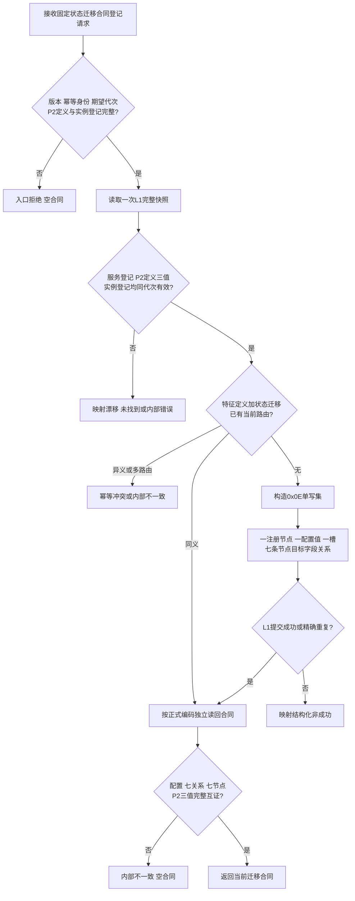
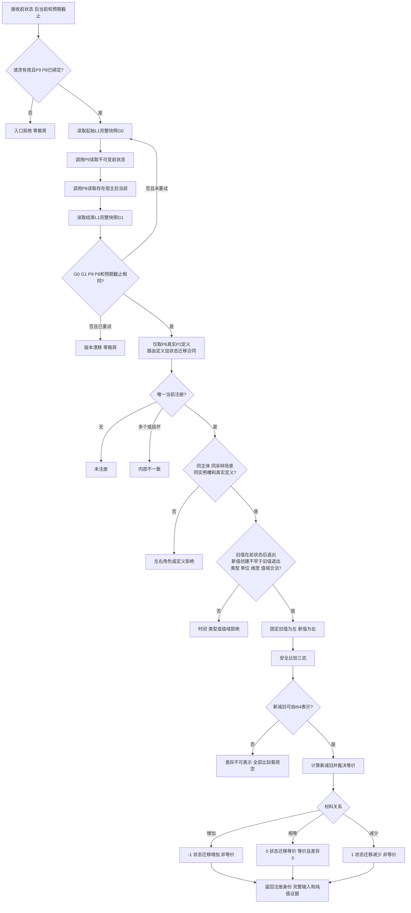

# I64 状态迁移登记与比较函数流程图 v0.1

## 登记迁移合同

```cpp
I64状态迁移比较合同结果 特征比较服务::登记I64状态迁移比较合同(
    const I64状态迁移比较合同登记请求& 请求);
```



## 比较状态迁移

```cpp
I64状态迁移比较结果 特征比较服务::比较I64状态迁移(
    const I64状态迁移比较请求& 请求) const;
```



边界：比较服务不解析关系19，只消费P9完整DTO；不发布第二状态、关系20、动态或因果。3F只能消费成功纯值证据，不能提供算法、注册或动态身份。
