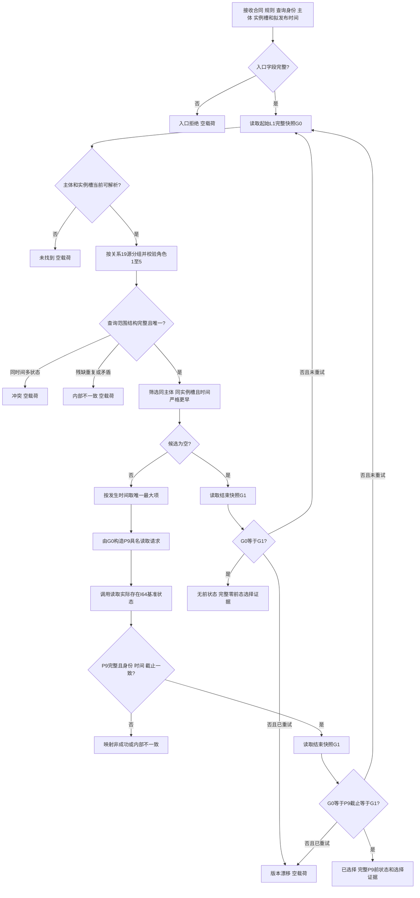

# L1-SIMPLIFY-P12-PRESTATE I64 相邻前状态选择函数流程图 v0.1

## 函数合同

```cpp
I64相邻前状态选择结果 L1状态服务::选择实际存在I64相邻前状态(
    const I64相邻前状态选择请求& 请求) const;
```

## 流程图



## 节点边界

| 节点 | 负责内容 | 禁止内容 |
| --- | --- | --- |
| E—G | 只解释关系19角色、状态资格、发生时间及查询范围 | 不解释P8定义、采样值来源、历史端点或比较算法 |
| J | 最大严格更早时间唯一选择 | 不按容器首项或稳定编码打破同时间冲突 |
| K—M | 调用P9同一公开入口取得完整不可变快照 | 不复制P9当前/历史读取逻辑，不让调用方提供P9编码组 |
| I/N—P | 首末代次和P9截止互证，至多完整重试一次 | 不返回混代材料，不持有L1许可跨函数调用 |

场景边界：选择器保留前状态冻结的采样场景，不用P7当前场景隐藏候选；跨场景是否允许直接形成迁移动能由P11和后继发布入口裁决。
