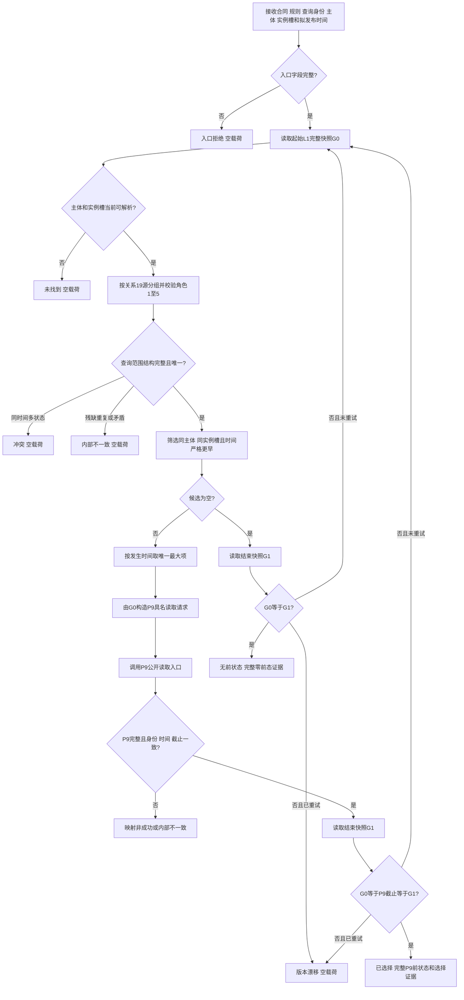

# L1-SIMPLIFY-P12-PRESTATE I64 相邻前状态选择函数流程图 v0.2

对应详细设计：`规范/详细设计/20260805_L1-SIMPLIFY-P12-PRESTATE_I64相邻前状态选择详细设计_v0.2.md`

正式基线：`cabe1794ab36226b10b3cecd1d03c8598b855793`

## 函数流程



## 自检登记边界

```text
既有启动登记：运行L1状态专项自检 -> 顺序360
P12动作：在领域/自检.L1状态.ixx的运行L1状态自检()内追加矩阵
禁止：启动文件新增顺序370、改写顺序360身份、第二顶层登记
```

自检追加矩阵覆盖零候选、唯一选择、乱序最大时间、等时冲突、未来/等时排除、主体/实例槽隔离、关系19损坏、P9非成功和首末代次漂移；流程图不改变业务函数根或启动依赖。
