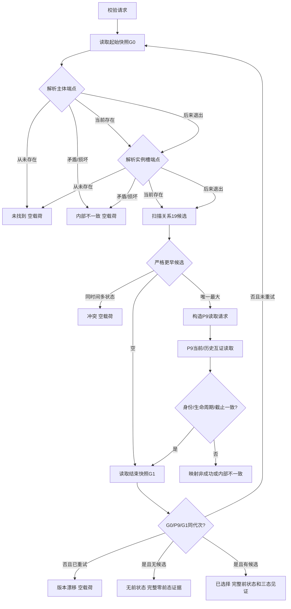

# L1-SIMPLIFY-P12-PRESTATE I64 相邻前状态选择函数流程图 v0.3

对应详细设计：`规范/详细设计/20260805_L1-SIMPLIFY-P12-PRESTATE_I64相邻前状态选择详细设计_v0.3.md`

正式基线：`06012409536b52b0d79ce66d34640cde507f22da`

端点解析只允许 L1 当前节点读取、历史事实读取及生命周期字段互证；禁止审计、SQL、日志、缓存和无条件历史扫描。顺序 360 既有状态自检追加三态矩阵，不新增顺序 370。
