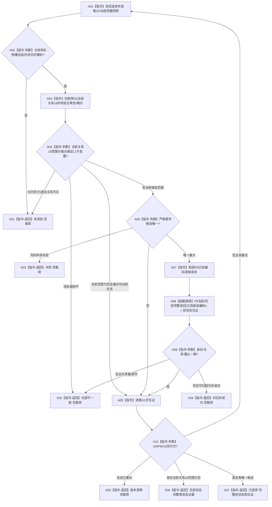

# L1-SIMPLIFY-P12-PRESTATE I64 相邻前状态选择函数流程图 v0.4

对应详细设计：`规范/详细设计/20260805_L1-SIMPLIFY-P12-PRESTATE_I64相邻前状态选择详细设计_v0.4.md`

正式基线：`5b68a6389cd6f1d5d15eb08d3497e6dfb289e090`

## 函数合同

```text
根函数：L1状态服务::选择实际存在I64相邻前状态
归属模块 / 文件 / 层级：海中鱼巣.领域.服务.L1状态 / 海中鱼巣/领域/服务.L1状态.ixx / L1领域服务
现有或待新增：待新增（P12 v0.4 施工目标）
完整签名：I64相邻前状态选择结果 L1状态服务::选择实际存在I64相邻前状态(const I64相邻前状态选择请求& 请求) const
参数：请求，const 引用，只读借用；必须包含主体稳定编码、实例槽稳定编码和拟发布时间，非法/空编码入口拒绝
返回结果：I64相邻前状态选择结果；成功为唯一严格更早前状态或合法无前状态，逻辑内返回包括未找到、冲突、版本漂移、许可/资源拒绝和内部不一致，所有非成功分支为空载荷
被调函数流程图：G0 当前完整快照读取、P9 已知编码当前/历史完整读回、G1 结束快照读取均为本函数内已冻结调用节点，不另设未冻结根函数
```



历史入口只位于 H 节点的已知候选读回；流程图没有历史关系枚举分支，也不新增启动顺序 370。顺序 360 既有自检追加退出端点不可达矩阵。

## 节点合同

| 节点 | 类型 | 参数 / 输入绑定 | 结果 / 输出绑定 | 事实读写 | 后继条件 | 验证 |
| --- | --- | --- | --- | --- | --- | --- |
| A01 | 指令 | 请求 -> 请求校验 | G0 -> 当前快照 | 只读 L1 当前快照 | 校验成功 | 非法请求拒绝 |
| A03 | 指令 | G0、请求端点 | 当前关系19候选范围 | 只读当前关系19 | 进入 A04 | 历史关系不枚举 |
| A08 | 函数调用 | 已选候选稳定编码 -> P9请求 | P9读回结果 -> 前状态见证 | 只读当前/历史已知编码入口 | 进入 A09 | 当前/历史互证 |
| A10 | 指令 | G0、P9、G1代次 | 同代次判断 | 只读代次 | 成功或一次完整重试 | 版本漂移矩阵 |
| X01/X02/X03/X04/X05/X06/X07 | 指令-返回 | 当前分支结果 | 结构化选择结果 | 非成功零载荷；成功只读返回 | 函数结束 | 全分支自检 |
