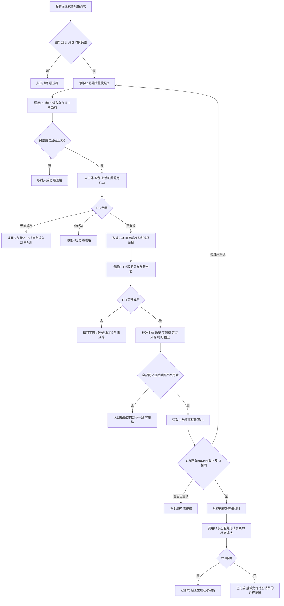
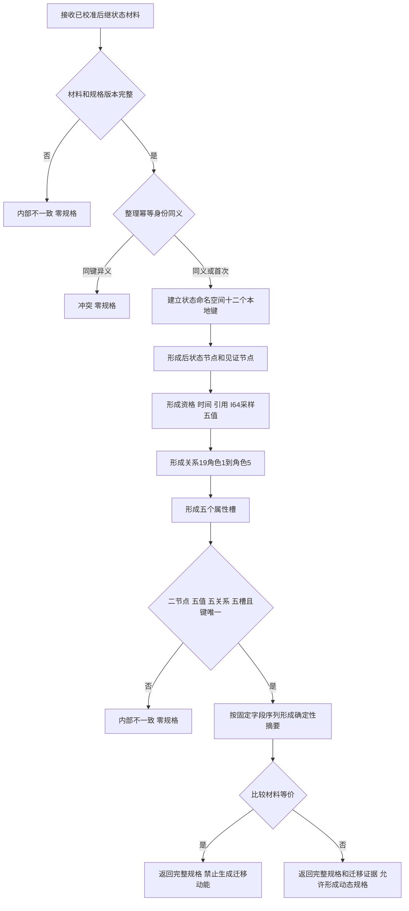
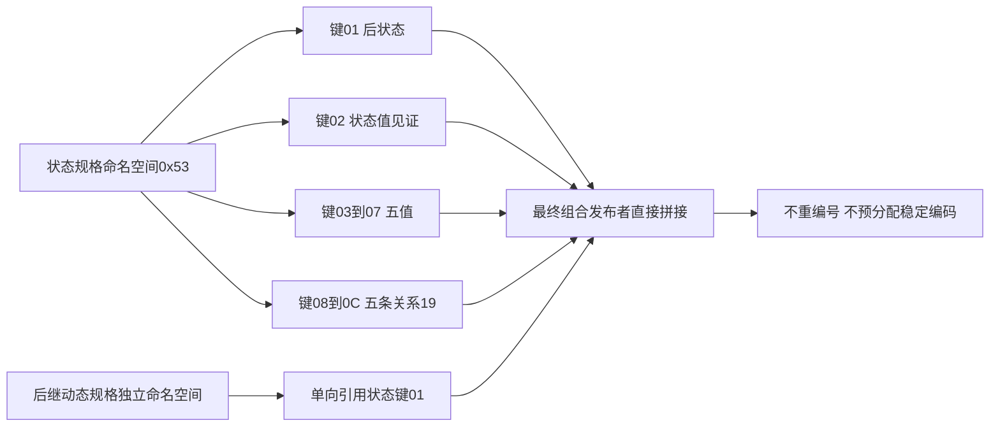

# L1-SIMPLIFY-P13-STATE-SPEC 实际存在 I64 后继状态规格函数流程图 v0.1

日期：2026-08-05

状态：设计就绪；代码未实现

## 1. 组合入口

## 2. 状态领域规格形成入口

## 3. 局部键与后继拼接

## 4. 边界

图中所有成功结果仍只是内存纯值规格。本叶不调用 L1 写入，不发布第二状态或关系20，不生成动作动态，不建立最终幂等账。状态服务不导入特征比较服务；跨领域调用只在无写权组合器中发生。
