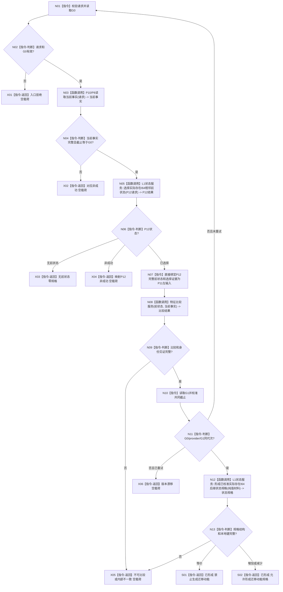

# L1-SIMPLIFY-P13-STATE-SPEC 实际存在 I64 后继状态规格函数流程图 v0.2

对应详细设计：`规范/详细设计/20260805_L1-SIMPLIFY-P13-STATE-SPEC_实际存在I64后继关系19状态写入规格详细设计_v0.2.md`

正式基线：`a3a346ea0fc79fb1870fe95fd5710a17ce5da313`

## 函数合同

```text
根函数：形成实际存在I64后继状态规格
归属模块 / 文件 / 层级：海中鱼巣.领域.组合.后继状态规格 / 海中鱼巣/领域/组合.后继状态规格.ixx / L1纯值组合层
现有或待新增：待新增（P13 v0.2施工目标）
完整签名：实际存在I64后继状态规格结果 形成实际存在I64后继状态规格(L1事实基座服务& L1实例特征服务& L1状态服务& 特征比较服务& const 实际存在I64后继状态规格请求& 请求)
参数：四个服务为非拥有引用，仅用于本轮只读调用；请求只含业务身份、发生时间和当前事实定位，不含前状态、算法、注册、截止、许可或事务
返回结果：已形成、无前状态、入口拒绝、未找到、冲突、不可比较、版本漂移、许可拒绝、资源失败或内部不一致；除已形成外规格与迁移证据为空
```

## 流程图



P12 只在 N05 调用一次；其 `已选择` 返回已完成 P9 读回互证的完整前状态，P13 不再另造 P9 调用。P12 v0.4 专项仍由既有顺序360承载，不新增顺序370。

## 节点验证

| 节点 | 事实读写 | 验证 |
| --- | --- | --- |
| N03 | 只读 P10/P8 当前事实 | 完整 DTO、同一截止 |
| N05 | 只读 P12 请求/结果 | 请求字段逐项闭合，状态映射与非成功空载荷 |
| N08 | 只读 P11 比较 | 左=P12前状态、右=P10/P8当前 |
| N10 | 只读 G1 | 一次完整重试，漂移不返回混代材料 |
| N12 | 纯值构造，不写 L1 | 二节点、五值、五关系、五槽、本地键唯一 |
| X01-X06/S01-S02 | 结构化返回 | 全分支矩阵与零事实变化 |
