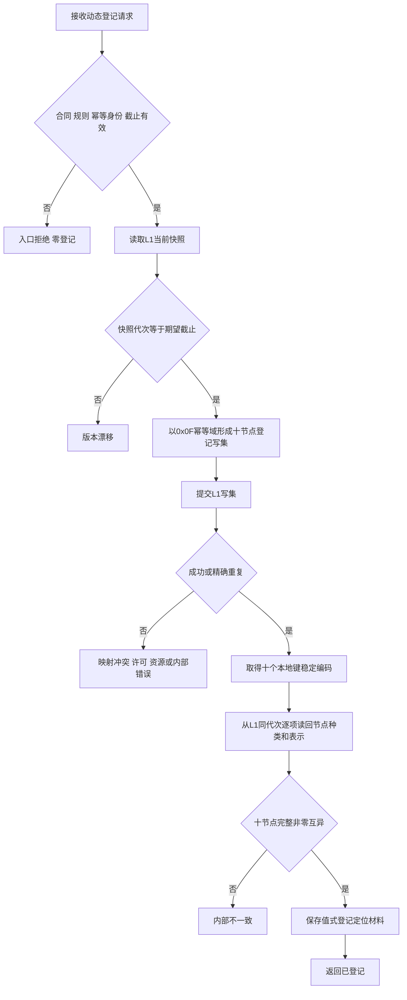
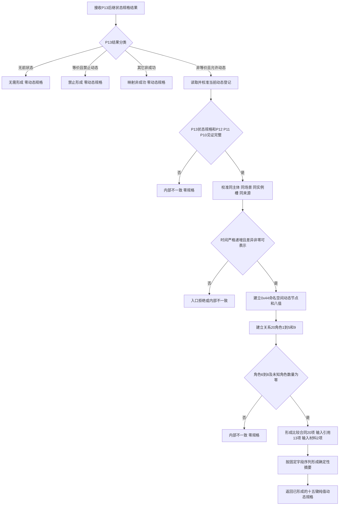
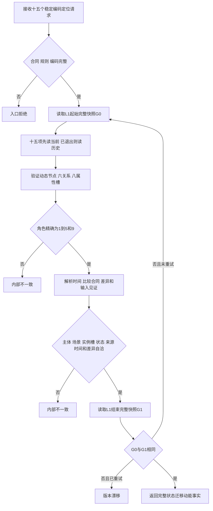
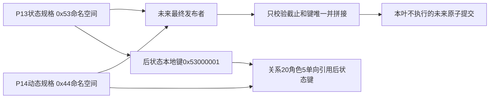

# L1-SIMPLIFY-P14-DYNAMIC-SPEC 形成与读取状态迁移动能函数流程图 v0.1

日期：2026-08-05

状态：设计就绪；代码未实现

## 1. 建立并读取动态登记

## 2. 形成状态迁移动能纯值规格

## 3. 独立读取已发布迁移动能

## 4. 规格拼接边界

角色6来源动作、角色7来源低层动态、角色8同源状态迁移动能始终为空；流程中不得创建占位节点或占位关系。本叶只形成规格，最终原子提交不属于本图实现范围。
